# N8N Demo Execution Guide - Class Climate Agent

เอกสารนี้สรุป workflow n8n ที่ใช้ในระบบ **Class Climate Agent** แบบละเอียด โดยเน้น 2 อย่างพร้อมกัน:

1. โครงสร้าง workflow ที่ใช้อยู่ในปัจจุบัน
2. execution ที่ควรยกมาเล่าในเดโมจริง

เป้าหมายคือให้เอกสารนี้ใช้เป็นทั้ง **คู่มืออธิบายระบบ**, **สคริปต์พูดหน้ากล้อง**, และ **checklist ตอนกดรัน n8n** ได้ในไฟล์เดียว

---

## 1) ภาพรวม workflow ที่ใช้ตอนนี้

ระบบ n8n ของโปรเจกต์นี้แบ่งได้เป็น 3 กลุ่มหลัก:

### A. Production / user-facing workflows

| Workflow | ไฟล์ | Trigger | บทบาท | ใช้ในเดโม |
|---|---|---|---|---|
| `climate-agent-main-v2` | `n8n/workflows/climate-agent-main-v2.json` | Schedule (`Daily Climate Check Trigger`) | แกนวิเคราะห์ climate แบบ privacy-safe, สร้าง recommendation, enforce confidence/frequency guard, log audit | ใช้พูดอธิบาย “ระบบหลัก” |
| `agentic-ai-recommendation` | `n8n/workflows/agentic-ai-recommendation.json` | Schedule | รุ่น agentic workflow แบบคลาสสิกที่ใช้ tool sub-workflows | ใช้อธิบายโครง agentic AI |
| `W06-morning-briefing-v2` | `n8n/workflows/W06-morning-briefing-v2.json` | Schedule | daily briefing ให้ครู, สรุปภาพรวมก่อนสอน | ใช้เป็นภาพรวมการส่งคำแนะนำรายวัน |
| `handle-teacher-approval` | `n8n/workflows/handle-teacher-approval.json` | Webhook | รับผล approve/dismiss จากครู, บันทึก audit, ตอบกลับ | ใช้อธิบาย human-in-the-loop |
| `loop-closure-notification` | `n8n/workflows/loop-closure-notification.json` | Webhook | ส่ง notification กลับไปฝั่งนักเรียนเมื่อ loop ปิด | ใช้อธิบาย closing the loop |

### B. Tool / sub-workflows

| Tool workflow | บทบาท |
|---|---|
| `tool-get-class-climate-summary` | ดึงสรุป climate ของห้องเรียนจาก Supabase RPC |
| `tool-get-past-recommendations` | ดึงคำแนะนำย้อนหลังเพื่อกันการแนะนำซ้ำ |
| `tool-get-trend-comparison` | เปรียบเทียบเทรนด์ของห้องสัปดาห์นี้กับสัปดาห์ก่อน |
| `tool-count-enrolled-students` | นับจำนวนนักเรียนที่ลงทะเบียนในห้อง |
| `tool-get-teacher-action-rate` | ดูอัตราการ approve ของครูเพื่อปรับโทนคำแนะนำ |
| `tool-submit-recommendation` | บันทึก recommendation ลงฐานข้อมูลแบบปลอดภัย |
| `Tool: Get Raw Snippet Batch` | ดึง batch ความเห็นดิบที่ผ่าน guard มาแล้วจาก Supabase RPC |
| `Tool: Write Redacted Snippets` | เขียนเสียงนักเรียนที่ถูก redacted กลับลงระบบ |

### C. Demo harness workflows

| Workflow | ไฟล์ | บทบาท |
|---|---|---|
| `phase-c-redaction-batch` | `n8n/workflows/phase-c-redaction-batch.json` | workflow ตัวแม่ที่ใช้เดโม redaction pipeline แบบ end-to-end |

---

## 2) แผนที่การไหลของระบบ

```mermaid
flowchart LR
    DS["Demo Dataset
    supabase/seed/presentation-dataset.sql"] --> PRE

    subgraph PRE["Preprocessing"]
        PRE1["Student / Teacher UI"] --> PRE2["Next.js Route Handlers"]
        PRE2 --> PRE3["Supabase Auth"]
        PRE3 --> PRE4["Supabase Postgres"]
        PRE4 --> PRE5["Privacy Guard / Aggregation"]
    end

    PRE5 --> DEMO["phase-c-redaction-batch"]
    DEMO --> CHILD["Tool: Get Raw Snippet Batch"]
    CHILD --> LLM["Redaction LLM Chain / Ollama"]
    LLM --> WRITE["Tool: Write Redacted Snippets"]
    WRITE --> MAIN["climate-agent-main-v2"]
    MAIN --> APPROVAL["handle-teacher-approval"]
    APPROVAL --> LOOP["loop-closure-notification"]
```

ภาพรวมที่ควรเล่าในคลิปคือ:

- ข้อมูลตั้งต้นมาจาก `presentation-dataset.sql`
- ฝั่ง preprocessing จะจัดข้อมูลให้พร้อมใช้งานและปลอดภัยก่อน
- workflow ตัวแม่ `phase-c-redaction-batch` จะใช้ข้อมูลนั้นเพื่อทดสอบ redaction pipeline
- child workflow `Tool: Get Raw Snippet Batch` จะดึง batch จริงจาก Supabase
- LLM จะช่วย redaction / สรุป
- งานฝั่ง recommendation หลักจะอยู่ที่ `climate-agent-main-v2`
- ถ้าครู approve ระบบจะไปปิด loop ผ่าน `handle-teacher-approval` และ `loop-closure-notification`

---

## 3) Execution ที่ควรใช้พูดในเดโม

### 3.1 Execution Story ที่แนะนำที่สุด

ถ้าต้องเล่าให้คนฟังเข้าใจเร็วที่สุด ให้ใช้ลำดับนี้:

1. Seed ข้อมูลด้วย `supabase/seed/presentation-dataset.sql`
2. รัน parent workflow `phase-c-redaction-batch`
3. ให้ child `Tool: Get Raw Snippet Batch` วิ่งจาก `Build Redaction Context`
4. แสดง case valid ที่ออก `status: ready`
5. แสดง case invalid ที่ออก `status: invalid_class_id`
6. ชี้ต่อไปยัง `climate-agent-main-v2` ว่าคือ workflow หลักของระบบ recommendation
7. ปิดท้ายด้วย approval / loop closure

### 3.2 ทำไมต้องใช้ parent workflow เป็นตัวเล่า

ก่อนหน้านี้ถ้ารัน `Tool: Get Raw Snippet Batch` ตรง ๆ บางครั้งจะเห็นแค่ state ที่ไม่ครบ เพราะมันไม่ได้สะท้อน mapping จาก parent ทั้งหมด

แต่ถ้ารันผ่าน `phase-c-redaction-batch` จะเห็น flow จริงครบ:

- parent สร้าง context
- parent ส่ง `class_id`, `weeks`, `limit` ไปยัง child
- child validate แล้ว fetch batch
- child normalize เป็น output ที่ปลอดภัย
- parent เอาผลลัพธ์ไปสร้าง prompt และส่งต่อ downstream

---

## 4) Execution ที่ทดสอบแล้วจริง

### 4.1 Parent execution

| Item | Value |
|---|---|
| Parent workflow | `phase-c-redaction-batch` |
| Parent execution id | `686` |
| เป้าหมาย | เดโมเส้นทาง redaction pipeline แบบ end-to-end |

### 4.2 Child execution: valid case

| Item | Value |
|---|---|
| Child workflow | `Tool: Get Raw Snippet Batch` |
| Child execution id | `687` |
| Input class | `CS101 Introduction to Computing` |
| `class_id` | `10000000-0000-0000-0000-000000000001` |
| `weeks` | `4` |
| `limit` | `12` |
| ผลลัพธ์สุดท้าย | `status: ready` |
| `batch_size` | `6` |
| `contributing_students_count` | `3` |
| `rows.length` | `6` |

### 4.3 Child execution: invalid regression case

| Item | Value |
|---|---|
| Child workflow | `Tool: Get Raw Snippet Batch` |
| Child execution id | `688` |
| Input class_id | `""` |
| ผลลัพธ์สุดท้าย | `status: invalid_class_id` |
| `batch_size` | `0` |
| `rows` | `[]` |

---

## 5) อธิบาย execution 686 แบบ node-by-node

workflow ตัวแม่ `phase-c-redaction-batch` มี node สำคัญดังนี้:

### 5.1 `When clicking 'Execute workflow'`
- เป็น manual trigger สำหรับเดโม
- ใช้เปิด workflow แบบคุมจังหวะเอง ไม่ต้องรอ schedule

### 5.2 `Fetch Target Classes`
- ดึง class list จาก Supabase
- query ที่ใช้เลือกเฉพาะ `id`, `name`, `teacher_id`
- ข้อมูลนี้มาจาก dataset seed ที่เตรียมไว้ก่อนเดโม

### 5.3 `Loop Over Classes`
- วนทีละห้อง
- ทำให้ demo สามารถโชว์หลาย class ได้ในรอบเดียว
- จุดนี้สำคัญเพราะทำให้เห็นว่า pipeline ไม่ได้ hardcode แค่ห้องเดียว

### 5.4 `Build Redaction Context`
- สร้าง context สำหรับแต่ละห้อง
- ใส่:
  - `class_id`
  - `class_name`
  - `weeks`
  - `limit`
  - `llm_provider`
  - `llm_model`
- ค่านี้จะถูกส่งต่อให้ child workflow

### 5.5 `Call Tool: Get Raw Snippet Batch`
- ใช้ `Execute Workflow`
- ส่ง `class_id`, `weeks`, `limit` ไปยัง child workflow
- จุดนี้คือสะพานจาก parent ไปยัง raw batch extraction

### 5.6 `Build Ollama Prompt`
- เอาผล batch ที่ได้มาสร้าง prompt สำหรับ redaction
- prompt จะมี:
  - aggregate context
  - safety rules
  - raw comment batch
- ถ้า batch ไม่ safe จะสร้าง prompt fallback ที่สั้นและปลอดภัย

### 5.7 `Redaction LLM Chain`
- เรียก LLM chain เพื่อ redaction / summarization
- ใช้ `Ollama Model`
- ในระบบนี้ LLM ไม่ได้อ่าน raw data แบบไร้ guard แต่ต้องผ่าน context ที่เตรียมไว้ก่อน

### 5.8 `Parse Redaction Output`
- ตรวจผล LLM
- กรองข้อความที่:
  - คล้าย quote ตรงเกินไป
  - เปิดเผยข้อมูลรายบุคคล
  - generic เกินไป
  - ไม่มีสัญญาณ classroom ที่ใช้งานได้
- output ที่ผ่านจะถูกจัดเป็น `ready_to_write`

### 5.9 `Call Tool: Write Redacted Snippets`
- เขียน snippet ที่ผ่านการ redaction ลงระบบ
- ใช้ workflow แยกเพื่อแยก logic database write ออกจาก logic LLM

### 5.10 `Normalize Pipeline Result` และ `Build Audit Payload`
- รวมผลลัพธ์ให้เป็นรูปแบบเดียว
- เตรียม payload สำหรับ audit log

### 5.11 `Insert Audit Log`
- บันทึกว่า run นี้เกิดอะไรขึ้น
- ช่วยให้เดโมอธิบายได้ว่า system มี traceability

---

## 6) อธิบาย execution 687 แบบ node-by-node

child workflow `Tool: Get Raw Snippet Batch` คือจุดที่ควรโชว์ว่าระบบ “คัดกรองก่อนส่งต่อ” อย่างไร

### 6.1 `Execute Workflow Trigger`
- รับ input จาก parent
- fields ที่รับคือ:
  - `class_id`
  - `weeks`
  - `limit`

### 6.2 `Validate Raw Batch Input`
- ตรวจ `class_id` ว่าไม่ว่างและเป็น UUID รูปแบบที่รับได้
- ตอนแรกเราเคยติดปัญหา regex เข้มเกินไป
- ปัจจุบัน workflow ใช้ generic UUID pattern แล้ว จึงรับ seed id ได้

### 6.3 `Has Valid Class ID?`
- ถ้า valid จะไป fetch batch
- ถ้า invalid จะข้าม RPC และไป normalize เป็น `invalid_class_id`

### 6.4 `Fetch Raw Snippet Batch`
- เรียก Supabase RPC:
  - `get_raw_redaction_comment_batch`
- ใช้ URL จาก env:
  - `={{ $env.SUPABASE_URL }}/rest/v1/rpc/get_raw_redaction_comment_batch`
- ใช้ credential `Supabase account`

### 6.5 `Normalize Raw Batch`
- ถ้าได้ข้อมูลจริง จะคืน:
  - `status: ready`
  - `reason: null`
  - `batch_size: 6`
  - `contributing_students_count: 3`
  - `rows.length: 6`
- ถ้าไม่มีข้อมูลหรือ class_id ไม่ถูกต้อง จะคืน `invalid_class_id` หรือ `no_safe_batch`

### 6.6 สิ่งที่ควรพูดในคลิป

> จุดนี้เป็นตัวอย่างของการทำงานแบบ privacy-first จริง ๆ ครับ  
> ระบบจะไม่ดึง raw data แบบตรง ๆ ไปให้โมเดลทันที แต่จะตรวจ class_id, ดึงข้อมูลจาก RPC ที่ปลอดภัย, แล้วค่อย normalize ให้พร้อมใช้งานต่อ  
> ถ้าข้อมูลไม่ผ่านก็จะไม่พยายามเดาเกินจริง และจะคืนสถานะที่อ่านได้ชัดเจนแทนครับ

---

## 7) การเชื่อมไปยัง workflow หลักของระบบ

แม้ `phase-c-redaction-batch` จะเป็น workflow เดโมหลัก แต่ workflow หลักที่อธิบายผลิตภัณฑ์จริงคือ `climate-agent-main-v2`

### 7.1 `climate-agent-main-v2`

node สำคัญที่ควรเล่า:

- `Daily Climate Check Trigger`
- `Get Aggregated Climate Data`
- `Validate n >= 3`
- `Tool: Get Teacher Metrics`
- `Call 'Tool: Get Past Recommendations'`
- `Merge Metrics Into Item`
- `Build Ollama Analysis Prompt`
- `Climate Analysis Agent`
- `Ollama Model`
- `Parse AI Recommendation Output`
- `Fallback Policy Engine`
- `Check AI Confidence`
- `Route by Policy Level`
- `Check Frequency Limits (ROUTINE / WARNING / CRITICAL)`
- `Frequency Guard (ROUTINE / WARNING / CRITICAL)`
- `Insert Draft Recommendation`
- `Email Alert - WARNING to Teacher`
- `Email Alert - CRITICAL to Admin`
- `Insert Audit Log`
- `Workflow Error Handler`
- `Insert Error Log`

### 7.2 คำอธิบายแบบสั้น

workflow นี้คือ “สมองหลัก” ของระบบ:

1. ดึง climate data แบบ aggregate
2. เช็กว่า k-anonymity ผ่านหรือไม่
3. ดึง teacher metrics และ recommendation เดิม
4. สร้าง prompt ให้ LLM
5. ตรวจ confidence
6. เลือก policy ตามระดับความเสี่ยง
7. เขียน draft recommendation
8. ส่งแจ้งเตือนเฉพาะเมื่อถึงเงื่อนไข
9. บันทึก audit

### 7.3 ประโยคที่ควรใช้พูดตอนพรีเซนต์

> ส่วน workflow หลักของระบบจะเริ่มจากข้อมูลแบบ aggregate ก่อนเสมอครับ  
> จากนั้น n8n จะดึง context ที่จำเป็น เช่น teacher metrics และ recommendation เดิม แล้วค่อยให้ LLM วิเคราะห์  
> ผลลัพธ์จะไม่ถูกส่งออกไปแบบทันที แต่จะผ่าน confidence check, frequency guard และ audit log ก่อน เพื่อให้เป็น human-in-the-loop และปลอดภัยต่อการใช้งานจริงครับ

---

## 8) Workflow สำหรับ approval และ loop closure

### 8.1 `handle-teacher-approval`

node สำคัญ:

- `Teacher Approval Webhook`
- `Validate Payload`
- `Is Valid?`
- `Insert Audit Log`
- `Send Teacher Email`
- `Respond 200`
- `Respond 400`
- `Workflow Error Handler`
- `Insert Error Log`
- `Respond 500`

บทบาทของ workflow นี้คือรับผลการ approve/dismiss จากครูและบันทึกทุกอย่างไว้เป็นหลักฐาน

### 8.2 `loop-closure-notification`

node สำคัญ:

- `Supabase Webhook Trigger`
- `Insert In-App Notifications`
- `Notify Next.js Webhook`

บทบาทของ workflow นี้คือปิด loop กลับไปยังฝั่งนักเรียน เมื่อครูมี action แล้วระบบจะส่ง notification และอัปเดตหน้าเว็บให้สะท้อน feedback loop ที่สมบูรณ์

### 8.3 ประโยคที่ใช้พูดในเดโม

> หลังครู approve ระบบจะไม่จบแค่ในฝั่งครูนะครับ  
> n8n จะส่งผลต่อไปยัง workflow loop closure เพื่อแจ้งนักเรียนและอัปเดตสถานะในระบบ ทำให้ผู้ใช้เห็นว่าข้อเสนอแนะมีการตอบกลับจริง ไม่ได้หยุดอยู่ที่ AI วิเคราะห์อย่างเดียวครับ

---

## 9) Script สั้นสำหรับพูดหน้ากล้อง

ถ้าต้องพูดสั้น ๆ ต่อหน้ากล้อง ให้ใช้ sequence นี้:

> เราเริ่มจากการ seed ข้อมูลเดโมเข้า Supabase ก่อนครับ  
> จากนั้นใช้ workflow ตัวแม่ `phase-c-redaction-batch` เพื่อไล่ห้องเรียนแล้วส่งต่อไปยัง `Tool: Get Raw Snippet Batch`  
> ถ้าห้องนั้นมีข้อมูลปลอดภัยพอ ระบบจะคืน `status: ready` แล้วส่งต่อไปยัง LLM เพื่อ redaction และบันทึกผลลงระบบ  
> ถ้าข้อมูลยังไม่พอ ระบบจะไม่ overclaim และจะคืนสถานะ invalid หรือ no safe batch อย่างชัดเจน  
> หลังจากนั้น workflow หลัก `climate-agent-main-v2` จะนำข้อมูล aggregate ไปวิเคราะห์ สร้าง recommendation draft และคุมด้วย confidence / frequency guard ก่อนให้ครู approve  
> สุดท้าย `handle-teacher-approval` และ `loop-closure-notification` จะปิด loop กลับไปยังนักเรียนครับ

---

## 10) Checklist ตอนรันเดโม

- [ ] โหลด `supabase/seed/presentation-dataset.sql`
- [ ] ตรวจว่า `CS101 Introduction to Computing` มีข้อมูลพร้อมสำหรับ valid case
- [ ] เปิด `phase-c-redaction-batch`
- [ ] รัน parent execution
- [ ] ยืนยัน child execution valid ให้ได้ `status: ready`
- [ ] ยืนยัน child execution invalid ให้ได้ `status: invalid_class_id`
- [ ] เปิด `climate-agent-main-v2`
- [ ] ตรวจว่า `Get Aggregated Climate Data` ใช้ `Supabase account`
- [ ] ตรวจว่ามี audit log เขียนครบ
- [ ] เปิด `handle-teacher-approval`
- [ ] เปิด `loop-closure-notification`

---

## 11) สรุปสั้นที่สุด

ถ้าต้องสรุประบบ n8n ของโปรเจกต์นี้ในประโยคเดียว:

> ข้อมูลนักเรียนถูก seed และ aggregate อย่างปลอดภัยก่อน จากนั้น n8n จะใช้ workflow ตัวแม่และ child workflows เพื่อคัดกรอง, redaction, วิเคราะห์, สร้าง recommendation, ให้ครู approve, แล้วปิด loop กลับไปหานักเรียนอย่างเป็นระบบครับ

