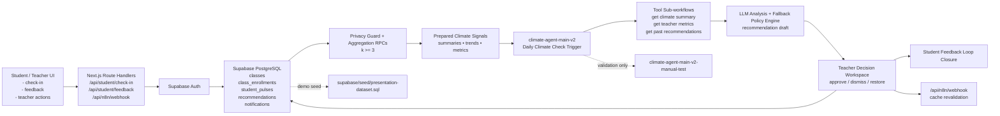

# Presentation Script: Class Climate Agent

เอกสารนี้จัดทำขึ้นสำหรับใช้ประกอบคลิปวิดีโอนำเสนอโปรเจกต์ **Class Climate Agent** โดยแยกให้ชัดระหว่าง
`สิ่งที่แสดงบนสไลด์` กับ `สคริปต์คำบรรยาย` เพื่อให้อ่านง่าย ซ้อมง่าย และอัดคลิปได้ตรง flow ของระบบจริง

**Project Name:** Class Climate Agent  
**Subtitle:** AI-powered Classroom Climate Early Warning System  
**Tech Stack:** Next.js, React, Tailwind CSS, Supabase, n8n, LangChain / Gemini  
**Dataset:** `supabase/seed/presentation-dataset.sql`
**Demo Setup:** apply Supabase migrations, provision demo auth accounts, then seed the canonical demo bundle from `supabase/seed/presentation-dataset.sql`
**Submission Pack:** source code + dataset seed, plus Google Drive clip link in the final submission

---

## ลำดับที่ 1: ชื่อระบบ + Logo ระบบ

### เนื้อหาที่แสดงบนหน้าจอ (Visuals):
- ชื่อระบบ `Class Climate Agent`
- Logo ของระบบ
- subtitle สั้น ๆ: `AI-powered Classroom Climate Early Warning System`
- โทนสไลด์ควรสะอาด เนี้ยบ และให้ชื่อระบบเด่นที่สุด

### สคริปต์คำบรรยาย (ภาษาไทย):
> สวัสดีครับ โปรเจกต์ของพวกเราชื่อ **Class Climate Agent** เป็นระบบ Agentic AI ที่ช่วยติดตามบรรยากาศในห้องเรียนแบบ privacy-safe และช่วยให้ครูเห็นสัญญาณสำคัญได้เร็วขึ้น โดยยังคงให้ครูเป็นผู้ตัดสินใจขั้นสุดท้ายเสมอครับ

---

## ลำดับที่ 2: Pain Point

### เนื้อหาที่แสดงบนหน้าจอ (Visuals):
- ภาพห้องเรียนที่สื่อถึงปัญหา
- ข้อความสั้น ๆ บนสไลด์:
  - `ครูเห็นปัญหาช้า`
  - `นักเรียนไม่กล้าพูดตรง ๆ`
  - `ข้อมูลดิบเสี่ยงต่อความเป็นส่วนตัว`

### สคริปต์คำบรรยาย (ภาษาไทย):
> ปัญหาหลักของห้องเรียนจริงคือ สัญญาณบางอย่างไม่ได้ดังพอให้เห็นทันที นักเรียนอาจเริ่มเหนื่อย เครียด หรือรู้สึกไม่เป็นธรรม แต่ครูอาจรับรู้ช้าเกินไป  
> อีกด้านหนึ่ง ถ้าเราเอาข้อความดิบของนักเรียนมาเปิดตรง ๆ ก็อาจกระทบความเป็นส่วนตัวได้  
> ดังนั้นระบบนี้จึงออกแบบให้ AI ช่วยสรุปข้อมูลแบบ aggregate เท่านั้น เพื่อให้เห็นภาพรวมเร็วขึ้น โดยไม่ละเมิดความเป็นส่วนตัวของนักเรียนครับ

---

## ลำดับที่ 3: Demo การทำงานของระบบ

> ลำดับนี้เป็นหัวใจของคลิป ควรเดโมให้เห็นทั้ง happy path, privacy-safe case, fallback case และ error case แบบไล่จากง่ายไปยาก เพื่อให้ผู้ฟังเห็นภาพครบว่าระบบนี้ทำอะไรได้บ้าง

### 3.1 Demo Setup: เตรียมข้อมูลและเข้าสู่ระบบ

#### เนื้อหาที่แสดงบนหน้าจอ (Visuals):
- เปิด browser ไปที่ `http://localhost:3000`
- แสดงสั้น ๆ ว่าก่อนเดโม เรา:
  1. apply migrations ให้ schema ตรงกับโค้ด
  2. provision demo auth accounts ผ่าน Supabase Auth
  3. seed canonical demo data bundle จาก `supabase/seed/presentation-dataset.sql`
- พูดสั้น ๆ ว่าชุดเดโมนี้เตรียมไว้แล้ว:
  - `3` ห้องเรียนเดโม
  - student check-in / climate trend
  - recommendation สำหรับฝั่งครู
- Login ด้วยบัญชีนักเรียนเดโม
  - `student1@demo.com`
  - `password123`
- ถัดไป logout แล้ว login ด้วยบัญชีครูเดโม
  - `teacher@demo.com`
  - `password123`
- ชี้ให้เห็นว่าทั้งสองบทบาทใช้ระบบเดียวกัน แต่เห็นข้อมูลต่างกันตามสิทธิ์

#### สคริปต์คำบรรยาย (ภาษาไทย):
> ก่อนเริ่มเดโม เราจะ apply migrations ให้โครงสร้างฐานข้อมูลตรงกับเวอร์ชันล่าสุดของระบบก่อนครับ  
> จากนั้นเราจะ provision บัญชีเดโมของครูและนักเรียนผ่าน Supabase Auth เพื่อให้ password login ใช้งานได้จริงในสภาพแวดล้อมเดโม  
> แล้วจึง seed canonical demo bundle จาก `supabase/seed/presentation-dataset.sql` เพื่อโหลดข้อมูลตัวอย่างเข้า Supabase/Postgres ให้พร้อมสำหรับ student check-in, teacher dashboard, trend และ recommendation  
> ไฟล์นี้เป็นเพียงชุดเตรียมข้อมูลสำหรับเดโม ไม่ใช่ส่วนของ runtime logic ของระบบครับ  
> หลังเตรียมข้อมูลเสร็จ เราจะมีห้องเดโมพร้อมใช้งานอยู่แล้ว ทั้งห้องที่ใช้โชว์ happy path ห้องที่ใช้โชว์ warning หรือ pending context และห้องที่ใช้โชว์ empty state แบบ privacy-safe ครับ  
> ขั้นตอนนี้ช่วยให้เดโมมีสภาพแวดล้อมที่พร้อมใช้งาน และทำให้เราอธิบายการทำงานของระบบได้อย่างต่อเนื่องทั้งฝั่งนักเรียนและฝั่งครูครับ

### 3.2 Case 1: นักเรียนส่ง check-in สำเร็จ

#### เนื้อหาที่แสดงบนหน้าจอ (Visuals):
- เข้าเมนู `Student Classes`
- เลือกห้อง `CS101 Introduction to Computing`
- กด `เช็คอิน`
- กรอกข้อมูลตัวอย่าง เช่น
  - อารมณ์วันนี้
  - จังหวะการสอน
  - ความเป็นธรรมในห้อง
- กดส่งข้อมูล
- แสดงหน้า success หรือ confirmation ว่าส่งสำเร็จแล้ว

#### สคริปต์คำบรรยาย (ภาษาไทย):
> เริ่มจากฝั่งนักเรียนครับ เราจะใช้ห้อง `CS101 Introduction to Computing` เป็น happy path หลักของเดโม  
> นักเรียนสามารถส่ง check-in เพื่อสะท้อนความรู้สึกของตัวเองได้อย่างรวดเร็ว  
> สิ่งที่ระบบเก็บไม่ใช่ข้อความดิบเพื่อเอาไปเปิดให้คนอื่นดู แต่จะนำไปสรุปต่อในเชิงภาพรวม เพื่อให้ห้องเรียนปรับตัวได้โดยยังเคารพความเป็นส่วนตัวของนักเรียนครับ

### 3.3 Case 2: นักเรียนดู Student Feedback แบบสรุปภาพรวม

#### เนื้อหาที่แสดงบนหน้าจอ (Visuals):
- เปิดเมนู `Feedback`
- แสดงการ์ดสรุปที่อ่านง่าย
- ชี้ให้เห็น:
  - ภาพรวมของห้องสัปดาห์นี้
  - แนวโน้มที่ดีขึ้นหรือลดลง
  - การตอบสนองล่าสุดจากครู
- ถ้ามีกราฟ ให้เน้นว่าเป็นกราฟสรุป ไม่ใช่ raw data

#### สคริปต์คำบรรยาย (ภาษาไทย):
> หลังส่ง check-in แล้ว ระบบจะเปลี่ยนข้อมูลดิบให้เป็น feedback ที่อ่านง่ายครับ  
> ในเดโมนี้ `CS101` จะใช้โชว์ภาพรวมที่อ่านง่าย กราฟแนวโน้ม และการตอบสนองล่าสุดจากครู ซึ่งเป็นตัวอย่างของ flow ที่ทำงานได้ครบตั้งแต่ student input ไปจนถึง feedback summary  
> นักเรียนจึงเห็นภาพรวมของบรรยากาศห้องตัวเองได้ทันที ว่าสัปดาห์นี้เป็นอย่างไร และครูได้ตอบสนองกลับมาหรือยัง  
> จุดสำคัญคือหน้าตรงนี้ทำหน้าที่ “สรุป” ไม่ใช่ “เปิดข้อมูลดิบ” ครับ

### 3.4 Case 3: ครูดู Teacher Dashboard

#### เนื้อหาที่แสดงบนหน้าจอ (Visuals):
- Logout จาก student แล้ว login ด้วยบัญชีครูเดโม
- เปิดหน้า `Teacher Dashboard`
- ชี้ให้เห็น:
  - การ์ดแต่ละห้อง
  - risk badge
  - จำนวน students
  - สถานะ actions ที่ต้องติดตาม
- ชี้ให้เห็นบทบาทของห้องเดโมแต่ละห้อง:
  - `CS101 Introduction to Computing` = happy path / approved context
  - `gg` = warning / pending context
  - `กินหมูกระทะ` = privacy-safe no-data
- เลือกห้องเดโม `CS101 Introduction to Computing`

#### สคริปต์คำบรรยาย (ภาษาไทย):
> ฝั่งครูจะเห็นภาพรวมของทุกห้องในรูปแบบ aggregate ครับ  
> เราตั้งใจเตรียมห้องเดโมแต่ละห้องให้เล่าคนละสถานการณ์ เพื่อให้ผู้ฟังเห็นทั้งเคสปกติ เคสที่ยังต้องติดตาม และเคสที่ข้อมูลยังไม่พออย่างปลอดภัย  
> ระบบช่วยจัดลำดับว่าห้องไหนควรจับตาเป็นพิเศษ และห้องไหนมีสัญญาณเสี่ยงที่ควรเปิดดูต่อก่อน โดยครูไม่ต้องไล่ดูข้อมูลรายคนเองทั้งหมดครับ

### 3.5 Case 4: ครูเปิด Teacher Class Detail และดูฉบับร่าง / Action context

#### เนื้อหาที่แสดงบนหน้าจอ (Visuals):
- เปิดหน้า `teacher/class/[id]`
- แสดง:
  - ชื่อห้อง
  - risk badge
  - summary ของห้อง
  - ส่วน `ฉบับร่าง / แนวทางตอบสนอง`
  - ส่วน `Action context`
- ถ้ามีคำแนะนำ AI ให้ชี้ว่าเป็น draft ที่ครูตรวจทานได้
- แสดงส่วน privacy-safe / redacted voice ที่สรุปมาแล้ว
- ใช้ `CS101 Introduction to Computing` เป็นตัวอย่างหลักของ summary และ approved context

#### สคริปต์คำบรรยาย (ภาษาไทย):
> เมื่อครูเปิดดูรายละเอียดของห้อง ระบบจะสรุปแนวโน้มสำคัญขึ้นมาให้ทันทีครับ  
> ใน `CS101` เราจะใช้โชว์ summary หลักของห้อง, บริบทล่าสุด, และตัวอย่างของ recommendation ที่ถูกจัดการแล้ว เพื่อให้เห็นภาพรวมที่ต่อเนื่องจากฝั่งนักเรียน  
> ถ้า AI มีฉบับร่างอยู่แล้ว ครูจะเห็นเป็น draft ที่ตรวจทานต่อได้  
> แต่ถ้ายังไม่มี pending draft ใหม่ ระบบก็ยังสามารถแสดง action context จากบริบทล่าสุดของห้องได้ เพื่อไม่ให้หน้าจอว่างและเพื่อให้ครูเข้าใจว่าควรทำอะไรต่อครับ

### 3.6 Case 5: ครู approve action

#### เนื้อหาที่แสดงบนหน้าจอ (Visuals):
- เปิด recommendation card หรือ draft card
- กด `Approve`
- ใส่ note สั้น ๆ หากต้องการ
- ยืนยันการดำเนินการ
- แสดงสถานะว่า action ถูกส่งต่อเรียบร้อย

#### สคริปต์คำบรรยาย (ภาษาไทย):
> จุดเด่นของระบบคือ AI จะช่วยเสนอแนวทาง แต่ครูยังเป็นคนตัดสินใจสุดท้ายครับ  
> เมื่อครู approve แล้ว ระบบจะบันทึกการตอบสนองและส่งผลต่อ workflow ที่เกี่ยวข้องต่อไป ทำให้การทำงานเป็น human-in-the-loop อย่างชัดเจนครับ

### 3.7 Case 6: Loop Closure กลับไปฝั่งนักเรียน

#### เนื้อหาที่แสดงบนหน้าจอ (Visuals):
- กลับไปหน้า `Student Feedback`
- แสดง section `การตอบสนองล่าสุดจากครู`
- ให้เห็นว่าการตอบสนองจากครูเชื่อมกลับมาหานักเรียนแล้ว

#### สคริปต์คำบรรยาย (ภาษาไทย):
> หลังครู approve แล้ว นักเรียนจะเห็นการตอบสนองกลับในระบบครับ  
> ตรงนี้คือ feedback loop ที่ทำให้ระบบไม่หยุดอยู่แค่การวิเคราะห์ แต่เชื่อมกลับไปสู่การสื่อสารและการปรับปรุงห้องเรียนจริงได้ครับ

### 3.8 Case 7: ข้อมูลยังไม่พอ / ระบบไม่ overclaim

#### เนื้อหาที่แสดงบนหน้าจอ (Visuals):
- เลือกห้องที่ข้อมูลยังน้อย หรือช่วงเวลาที่เช็กอินยังไม่ถึงเกณฑ์
- ใช้ห้อง `กินหมูกระทะ` เป็นตัวอย่างหลักของ no-data / empty state
- แสดง state ว่า:
  - ยังไม่มีข้อมูลพอสำหรับสรุป
  - หรือมีเช็กอินแล้ว แต่ aggregate ยังไม่ถึงระดับที่ปลอดภัยพอ
- ชี้ให้เห็นว่าไม่มีการเปิดข้อมูลดิบที่เสี่ยงต่อการระบุตัวตน

#### สคริปต์คำบรรยาย (ภาษาไทย):
> ถ้าข้อมูลยังไม่ถึงระดับที่ปลอดภัยพอ ระบบจะไม่สรุปเกินจริงครับ  
> ห้อง `กินหมูกระทะ` ถูกเตรียมไว้เพื่อให้เราเดโม empty state แบบตั้งใจ ว่าถ้าไม่มีข้อมูลเพียงพอ ระบบจะไม่ฝืนสรุปและจะไม่เปิดข้อมูลที่เสี่ยงต่อการระบุตัวตน  
> บางกรณีอาจมีเช็กอินแล้ว แต่ยังไม่ถึงจำนวนที่เพียงพอสำหรับแสดง aggregate อย่างปลอดภัย ระบบก็จะบอกอย่างตรงไปตรงมาว่ายังไม่พร้อมแสดงแนวโน้มรายวัน  
> นี่คือแนวคิด privacy-by-design ที่เราใช้ตลอดทั้งระบบครับ

### 3.9 Case 8: Frequency Guard / Fallback Draft เมื่อไม่มี pending ใหม่

#### เนื้อหาที่แสดงบนหน้าจอ (Visuals):
- เลือกห้อง `gg`
- แสดงว่ารอบล่าสุดถูก frequency guard คุมไว้
- แต่ `ฉบับร่าง / แนวทางตอบสนอง` และ `Action context` ยังมีข้อความสรุปจากบริบทล่าสุด
- ชี้ให้เห็นว่าระบบยังไม่ส่งแจ้งเตือนถี่เกิน แต่ครูยังเห็นแนวทางต่อได้

#### สคริปต์คำบรรยาย (ภาษาไทย):
> อีกเคสหนึ่งคือกรณีที่ระบบประเมินว่าห้องยังมีความเสี่ยง แต่เพิ่งมีการแจ้งเตือนไปไม่นาน  
> ในเดโมนี้เราจะใช้ห้อง `gg` เพื่อโชว์ warning หรือ pending context ที่ยังต้องติดตามต่อ  
> ตรงนี้ frequency guard จะช่วยป้องกันการแจ้งซ้ำถี่เกินไป แต่ระบบยังคงแสดงฉบับร่างหรือ action context จากบริบทล่าสุดให้ครูเห็น  
> แบบนี้ครูจะไม่เจอหน้าว่าง และยังอ่านแนวทางตอบสนองต่อได้โดยไม่ทำให้ระบบ overnotify ครับ

### 3.10 Case 9: Error Case: ระบบหรือข้อมูลผิดพลาด

#### เนื้อหาที่แสดงบนหน้าจอ (Visuals):
- ใช้ตัวอย่างอย่างใดอย่างหนึ่ง:
  - login ผิด
  - session หมดอายุ
  - network ช้า
  - ไม่มีสิทธิ์เข้าถึงห้องนั้น
- แสดง toast / error message / fallback state ที่เข้าใจง่าย

#### สคริปต์คำบรรยาย (ภาษาไทย):
> ในกรณีที่ระบบเจอข้อผิดพลาด เช่น login ไม่สำเร็จ หรือข้อมูลยังโหลดไม่ครบ ระบบจะมีข้อความแจ้งเตือนที่ชัดเจนและปลอดภัยครับ  
> เป้าหมายคือให้ผู้ใช้รู้ว่าควรทำอะไรต่อ ไม่ทำให้สับสน และไม่ทำให้ flow ของการใช้งานขาดตอนครับ

### 3.11 แนะนำลำดับเดโม

#### เนื้อหาที่แสดงบนหน้าจอ (Visuals):
- Slide สรุปลำดับ demo สั้น ๆ:
  1. เตรียม demo dataset และ login
  2. `CS101` student check-in
  3. `CS101` student feedback
  4. Teacher dashboard และภาพรวม 3 ห้อง
  5. `CS101` class detail / summary / approved context
  6. Approve action
  7. Loop closure
  8. `กินหมูกระทะ` privacy-safe no-data
  9. `gg` fallback / warning / pending context
  10. error case

#### สคริปต์คำบรรยาย (ภาษาไทย):
> สำหรับเดโมจริง เราจะเริ่มจากฝั่งนักเรียน แล้วค่อยข้ามไปฝั่งครู จากนั้นกลับมาดูผลลัพธ์ที่ฝั่งนักเรียนอีกครั้ง  
> ถ้ามีเวลาเพิ่ม เราจะเสริมเคส privacy-safe, fallback draft และ error case เพื่อให้เห็นว่าระบบรองรับสถานการณ์จริงได้ครบครับ

---

## ลำดับที่ 4: Architecture & Process Review

### วิธีผูก Dataset นี้กับสไลด์ / คลิป

#### เนื้อหาที่แสดงบนหน้าจอ (Visuals):
- โค้ดบรรทัดสั้น ๆ สำหรับใส่ใน README หรือแสดงในสไลด์ setup:

```text
Apply Supabase migrations, provision demo auth, then load supabase/seed/presentation-dataset.sql.
```

- ถ้าใช้ประกอบคลิป ให้โชว์ว่าไฟล์ seed นี้เป็น canonical demo bundle สำหรับเตรียมฐานข้อมูล demo ก่อนเข้าสู่การเดโมจริง

### 4.1 Architecture of the Agentic AI System

#### เนื้อหาที่แสดงบนหน้าจอ (Visuals):
- ใช้ block diagram แบบ Mermaid หรือวาดเป็นกล่องลูกศร
- แสดง input → preprocessing → orchestration → output
- เน้น 2 โหมด:
  - Preprocessing Mode
  - Processing Mode
- แยกเส้นทาง `live core` ออกจาก `validation / demo seed`
- ใส่ callout เล็ก ๆ ว่า `presentation-dataset.sql → Supabase/Postgres seed`
- ถ้าจะอธิบาย workflow เก่า ให้ระบุเป็น `reference / inactive` ไม่ใช่ flow หลัก

#### Mermaid Diagram - เวอร์ชันสั้น:



#### Mermaid Diagram - เวอร์ชันสวยขึ้น:

```mermaid
flowchart LR
    subgraph PRE["Preprocessing Mode"]
        A["Student / Teacher UI
        - Check-in
        - Feedback
        - Approve / Dismiss
        - Restore draft"] --> B["Next.js Route Handlers
        - /api/student/check-in
        - /api/student/feedback
        - /api/n8n/webhook"]

        B --> C["Supabase Auth"]

        C --> DB["Supabase PostgreSQL
        Tables:
        classes
        class_enrollments
        student_pulses
        recommendations
        notifications"]

        DB --> F["Privacy Guard + Aggregation Layer
        - k-anonymity (k >= 3)
        - summary / trend RPCs
        - redact raw student data"]

        F --> G["Prepared Climate Signals
        - class climate summary
        - trend comparison
        - adoption metrics
        - redacted voice summary
        - approval history"]
    end

    subgraph PROC["Processing Mode"]
        G --> MAIN["climate-agent-main-v2
        Daily Climate Check Trigger"]

        MAIN --> T1["Tool Sub-workflows
        - get climate summary
        - get teacher metrics
        - get past recommendations
        - get aggregated climate data"]

        T1 --> LLM["LLM Analysis + Fallback Policy Engine
        privacy-safe recommendation draft"]

        LLM --> R["Decision Payload
        - policy level
        - confidence
        - teacherActionPlan
        - studentMessageDraft"]

        R --> S["Supabase Recommendations
        status / action_status / approval fields"]

        S --> U["Teacher Review / Approval
        Human-in-the-loop
        approve / dismiss / restore"]

        U --> APP["Teacher Dashboard / Class Detail
        - risk overview
        - action workspace
        - history / restore
        - updated classroom summary"]

        U --> WEBHOOK["/api/n8n/webhook
        cache revalidation"]

        U --> STUDENT["Student Feedback
        loop closure"]
    end

    DS["Demo Dataset Seed
    supabase/seed/presentation-dataset.sql"] -. seed only .-> DB
    DEMO["climate-agent-main-v2-manual-test"] -. validation only .-> MAIN

    REF["Reference / inactive workflows in repo
    - agentic-ai-recommendation
    - W06 Morning Briefing
    - loop-closure-notification
    - handle-teacher-approval
    - W03/W04/W05 archived"]:::muted

    MAIN -. related references only .-> REF

    classDef muted fill:#1f2937,stroke:#6b7280,color:#9ca3af,stroke-dasharray:4 4;
```



#### สคริปต์คำบรรยาย (ภาษาไทย) - เวอร์ชันสั้น:
> ถ้าดูแบบสั้น ๆ สถาปัตยกรรมของระบบเริ่มจากหน้า UI ของนักเรียนและครู แล้วส่งผ่าน Next.js ไปยัง Supabase ครับ  
> จากนั้นข้อมูลจะถูกสรุปผ่าน privacy guard ก่อนเข้าสู่ `climate-agent-main-v2` เพื่อให้ LLM วิเคราะห์และสร้าง recommendation draft โดยมีครูเป็นผู้ approve ในขั้นสุดท้าย  
> ชุดข้อมูลเดโมจะมาจาก `supabase/seed/presentation-dataset.sql` ส่วน workflow `climate-agent-main-v2-manual-test` ใช้สำหรับ validation เท่านั้น ไม่ใช่ runtime หลักของระบบครับ

#### สคริปต์คำบรรยาย (ภาษาไทย):
> สถาปัตยกรรมของระบบแบ่งเป็น 2 ส่วนหลัก คือ **Preprocessing Mode** และ **Processing Mode** ครับ  
> ในฝั่ง Preprocessing ระบบจะรับข้อมูลจากนักเรียนหรือครูผ่านหน้า Next.js frontend แล้วส่งต่อไปยัง Next.js route handlers จากนั้นจึงยืนยันสิทธิ์ผ่าน Supabase Auth และเก็บข้อมูลลงใน Supabase PostgreSQL  
> ก่อนนำข้อมูลไปใช้งานต่อ ระบบจะผ่านชั้น privacy guard และ aggregation layer เพื่อสรุปเฉพาะข้อมูลแบบ aggregate ที่ปลอดภัยต่อการวิเคราะห์  
> เมื่อเตรียมข้อมูลเสร็จแล้ว ระบบหลักที่ใช้งานจริงคือ `climate-agent-main-v2` ซึ่งทำหน้าที่นำ climate signals ไปวิเคราะห์ด้วย LLM สร้าง recommendation draft และส่งให้ครู review แบบ human-in-the-loop ก่อน approve ขั้นสุดท้าย  
> สำหรับการเดโม เราใช้ `supabase/seed/presentation-dataset.sql` เป็นชุดข้อมูลตั้งต้น และหากต้องการตรวจ flow แบบทดสอบ เราจะอ้างอิง `climate-agent-main-v2-manual-test` ในฐานะ validation workflow แยกจาก runtime หลักครับ  
> ส่วน workflow อย่าง `agentic-ai-recommendation`, `W06 Morning Briefing`, `loop-closure-notification` และ `handle-teacher-approval` จะถือเป็น reference หรือ inactive workflows ที่เก็บไว้เพื่ออธิบายแนวคิด แต่ไม่ใช่ flow หลักของ runtime ปัจจุบันครับ  
> และก่อนเดโมจริง เราจะ apply migrations ให้ schema ตรงกับโค้ดก่อน จากนั้น provision บัญชี demo auth ผ่าน Supabase Auth แล้วค่อย seed canonical demo bundle จาก `supabase/seed/presentation-dataset.sql` เพื่อให้สภาพแวดล้อมพร้อมใช้งานครับ

### 4.2 Development Process Review

#### เนื้อหาที่แสดงบนหน้าจอ (Visuals):
- UX/UI design
- Database & auth
- Frontend development
- API / Supabase integration
- n8n workflow
- AI analysis
- Testing with Playwright

#### สคริปต์คำบรรยาย (ภาษาไทย):
> ในมุมของ Development Process Review เราเริ่มจากการออกแบบ flow การใช้งานก่อนครับ ว่าฝั่งนักเรียนต้องส่ง check-in ได้ง่าย ส่วนฝั่งครูต้องอ่านภาพรวมและตัดสินใจได้เร็ว  
> จากนั้นเราออกแบบฐานข้อมูลและระบบ authentication บน Supabase ให้รองรับข้อมูลหลักของระบบ เช่น users, classes, class enrollments, student pulses, recommendations และ notifications รวมถึงกำหนด role และสิทธิ์การเข้าถึงให้ตรงกับ student และ teacher ครับ  
> เมื่อโครงสร้างข้อมูลพร้อมแล้ว เราจึงพัฒนา frontend ด้วย Next.js และ React โดยใช้ Tailwind CSS และ shadcn/ui เพื่อสร้างหน้า login, student dashboard, teacher dashboard และ class detail ให้ใช้งานจริงได้  
> ฝั่ง backend เราใช้ Next.js Route Handlers เป็น API layer สำหรับรับ student check-in, ดึง student feedback, รับ webhook จาก n8n และเชื่อมข้อมูลกับ Supabase อย่างเป็นระบบ  
> ในส่วนของ Agentic AI เราใช้ n8n เป็น workflow orchestrator โดยแยก workflow หลักและ tool workflows ออกจากกัน เช่น workflow สำหรับ climate recommendation, workflow สำหรับ redaction และ sub-workflows สำหรับดึง aggregate summary, trend comparison และ metrics ที่จำเป็นต่อการวิเคราะห์  
> ส่วน LLM จะรับเฉพาะข้อมูลที่ผ่าน privacy guard และ aggregation แล้ว ไม่ใช้ raw student data โดยตรงครับ ในทางปฏิบัติ LLM จะอ่าน 5 ส่วนหลักคือ aggregate ล่าสุดของห้อง, trend เทียบรอบก่อน, ประวัติการตอบสนองของครู, redacted voice summary และ closure history ล่าสุด จากนั้นจะคิด 3 คำถามก่อนร่างเสมอว่า ตอนนี้ห้องกำลังมีปัญหาอะไร, ครูควรเริ่มทำอะไร, และควรสื่อสารกับนักเรียนอย่างไรให้ช่วยสถานการณ์ได้จริง  
> ผลลัพธ์จึงไม่ได้มีแค่สรุปสถานการณ์ แต่จะออกมาเป็น 2 ชั้นพร้อมกัน คือ `studentMessageDraft` ซึ่งเป็นข้อความตั้งต้นที่ครูแก้ก่อนส่งถึงนักเรียนได้ และ `teacherActionPlan` ซึ่งเป็นแผนสั้น ๆ ที่ครูลองใช้ในคาบถัดไปได้จริงครับ  
> สำหรับการทดสอบ เราใช้ทั้ง execution log และ browser automation เพื่อให้มั่นใจว่าระบบทำงานได้ครบจริง โดยเฉพาะ Playwright ซึ่งเราใช้ตรวจ flow สำคัญแบบ end-to-end เช่น login ของครูและนักเรียน, student check-in ไปจนถึง feedback, และ teacher dashboard ไปจนถึงหน้า class detail  
> จุดสำคัญคือ Playwright ช่วยให้เราเห็นปัญหาที่เกิดกับการใช้งานจริงบนหน้าเว็บ เช่น redirect ไม่ถูกต้อง, state ไม่อัปเดต, หรือข้อความบนหน้าจอไม่ตรงกับข้อมูลในระบบ ทำให้เราปรับระบบได้ก่อนนำไปเดโมครับ  
> ดังนั้นในภาพรวม เครื่องมือแต่ละตัวจะรับผิดชอบคนละส่วนอย่างชัดเจน คือ Next.js ดูแล web application, Supabase ดูแล data และ auth, n8n ดูแล orchestration, LLM ดูแลการวิเคราะห์และสรุป, และ Playwright ช่วยยืนยันว่า flow ทั้งหมดทำงานร่วมกันได้จริงครับ

### 4.3 จุดเน้นที่ควรพูดเพิ่ม

#### สคริปต์คำบรรยาย (ภาษาไทย):
> จุดที่เราให้ความสำคัญมากคือ privacy-first, human-in-the-loop และการสรุปข้อมูลแบบ aggregate เท่านั้น เพื่อให้ระบบช่วยครูได้จริงโดยไม่ละเมิดความเป็นส่วนตัวของนักเรียนครับ

---

## ลำดับที่ 4.4: ข้อจำกัดของระบบ (Risks / Limitations)

### เนื้อหาที่แสดงบนหน้าจอ (Visuals):
- `Participation Bias`
  - นักเรียนไม่ทำ check-in
  - ส่งแบบไม่ตั้งใจหรือไม่จริงใจ
  - ข้อมูล aggregate จะเพี้ยนได้
- `Adoption`
  - ครูไม่เปิด dashboard สม่ำเสมอ
  - ไม่กด approve / dismiss
  - ระบบจะช่วยได้จำกัด

### สคริปต์คำบรรยาย (ภาษาไทย):
> ระบบนี้มีข้อจำกัดสำคัญอยู่สองเรื่องครับ  
> เรื่องแรกคือ participation ของนักเรียน ถ้านักเรียนไม่ทำ check-in หรือส่งข้อมูลแบบไม่ตั้งใจ ข้อมูลที่ AI เอาไปวิเคราะห์ก็จะสะท้อนภาพจริงได้ไม่ดี หรือบางช่วงอาจยังไม่ถึงเกณฑ์ privacy ที่กำหนดไว้ ทำให้ครูยังไม่เห็น aggregate รายวัน  
> เรื่องที่สองคือ adoption ของครู ต่อให้ระบบสรุปมาให้ดีแค่ไหน ถ้าครูไม่ค่อยเปิด dashboard หรือไม่กด approve และ dismiss อย่างสม่ำเสมอ ระบบก็จะช่วยได้ไม่เต็มที่  
> ดังนั้นสิ่งที่ระบบต้องมีควบคู่กันคือการทำให้การมีส่วนร่วมของนักเรียนดีขึ้น และทำให้ครูใช้งาน dashboard ได้เป็นนิสัยครับ

---

## ลำดับที่ 5: Future Work Development

### เนื้อหาที่แสดงบนหน้าจอ (Visuals):
- Roadmap สั้น ๆ 3-5 ข้อ
- ตัวอย่าง:
  - reminder / nudges เพื่อกระตุ้นการ check-in
  - onboarding และ workflow support สำหรับครู
  - analytics ระดับโรงเรียน
  - model monitoring
  - tracking ผลหลังครูดำเนินการ

### สคริปต์คำบรรยาย (ภาษาไทย):
> จากข้อจำกัดที่เราเล่าไป ระบบนี้สามารถต่อยอดได้อีกหลายด้านครับ  
> แกนแรกคือการเพิ่ม reminder หรือ nudges และปรับ check-in flow ให้ใช้ง่ายขึ้น เพื่อช่วยลดปัญหา participation bias และทำให้ข้อมูลที่ได้สม่ำเสมอขึ้น  
> แกนที่สองคือการเพิ่ม onboarding และ workflow support สำหรับครู เพื่อให้การเปิด dashboard การ approve หรือ dismiss กลายเป็นพฤติกรรมที่ทำได้ง่ายขึ้นในชีวิตประจำวัน  
> แกนสุดท้ายคือการขยายไปสู่ analytics ระดับโรงเรียน, model monitoring และ tracking ผลหลังครูดำเนินการ เพื่อให้ระบบมีความพร้อมในระดับ production มากขึ้นครับ  
> แนวทางทั้งหมดนี้จะช่วยลดผลกระทบจาก participation bias และ adoption bias และทำให้ระบบใช้งานจริงได้แข็งแรงขึ้นครับ

---

## ลำดับที่ 6: References

### เนื้อหาที่แสดงบนหน้าจอ (Visuals):
- รายการอ้างอิง 4-5 แหล่ง

### References
1. Next.js Documentation - https://nextjs.org/docs
2. Supabase Documentation - https://supabase.com/docs
3. n8n Documentation - https://docs.n8n.io
4. Google AI for Developers / Gemini API - https://ai.google.dev
5. Playwright Documentation - https://playwright.dev

### สคริปต์คำบรรยาย (ภาษาไทย):
> ส่วนการอ้างอิง เราใช้เอกสารทางการของเครื่องมือหลักที่ใช้ในโปรเจกต์ ทั้ง Next.js, Supabase, n8n และ Ollama รวมถึงเครื่องมือทดสอบอย่าง Playwright เพื่อให้การพัฒนาและการตรวจสอบมีความน่าเชื่อถือครับ

---

## ลำดับที่ 7: ทีมผู้จัดทำ + อาจารย์ที่ปรึกษา

### เนื้อหาที่แสดงบนหน้าจอ (Visuals):
- ภาพหมู่สมาชิก
- รายชื่อสมาชิก
- โลโก้มหาวิทยาลัยศรีนครินทรวิโรฒ
- โลโก้ระบบ Class Climate Agent
- ภาควิชาวิศวกรรมคอมพิวเตอร์ คณะวิศวกรรมศาสตร์ มหาวิทยาลัยศรีนครินทรวิโรฒ
- ที่ปรึกษา: `ผศ.วัชรชัย วิริยะสุทธิวงศ์`
- ที่ปรึกษาร่วม (ถ้ามี)

### ข้อความบนสไลด์
- ชื่อ-สกุลสมาชิกทุกคน
- ภาพหมู่สมาชิก
- ภาควิชาวิศวกรรมคอมพิวเตอร์ คณะวิศวกรรมศาสตร์ มหาวิทยาลัยศรีนครินทรวิโรฒ
- Logo มศว
- ที่ปรึกษา: `ผศ.วัชรชัย วิริยะสุทธิวงศ์`
- ที่ปรึกษาร่วม (ถ้ามี)

### หมายเหตุ
- ไม่ต้องใส่คำนำหน้า `นาย/นางสาว`
- ไม่ต้องใส่รหัสนิสิต

### สคริปต์คำบรรยาย (ภาษาไทย):
> สุดท้ายนี้ขอขอบคุณอาจารย์ที่ปรึกษาและผู้มีส่วนเกี่ยวข้องทุกท่านครับ โปรเจกต์นี้เป็นความตั้งใจของพวกเราที่อยากทำระบบ Agentic AI ที่ช่วยครูดูแลบรรยากาศในห้องเรียนได้อย่างมีประสิทธิภาพและเคารพความเป็นส่วนตัวของนักเรียนครับ

---

## วิธีใช้เอกสารนี้ใน Google Docs

- คัดลอกแต่ละสไลด์ไปวางเป็นหัวข้อแยกใน Google Docs
- ถ้าต้องการสไตล์สคริปต์พูด ให้ใช้บรรทัด `สคริปต์คำบรรยาย` เป็นข้อความพูดจริง
- ถ้าต้องการสไลด์สั้นลง ให้คงเฉพาะ `สิ่งที่แสดงบนสไลด์`
- ถ้าต้องการซ้อมพูด ให้เน้นอ่านเฉพาะสคริปต์คำบรรยายทีละสไลด์
