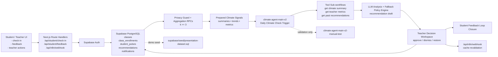

# Project Clip Guide: Class Climate Agent

คู่มือนี้จัดทำขึ้นเพื่อใช้เป็นเอกสารแนะนำการอัดคลิปนำเสนอโปรเจกต์ `Class Climate Agent` ให้ตรงตามรูปแบบการส่งงานที่อาจารย์กำหนด และให้สอดคล้องกับ flow จริงของระบบในโปรเจกต์นี้

## 1. สิ่งที่ต้องส่ง

ส่งงานทั้งหมด 2 ส่วน

1. `Source code + Dataset (ถ้ามี)`
2. `Clip นำเสนอระบบ` ในรูปแบบลิงก์ Google Drive

### สรุปไฟล์ส่งงานแบบสั้น

- Source code: repository โปรเจกต์ทั้งหมด
- Dataset: ใช้ seed data ของเดโมเป็นชุดข้อมูลแนบ
  - แนะนำ: [supabase/seed/presentation-dataset.sql](/Users/ark1/Public/Climate%20Agent/supabase/seed/presentation-dataset.sql)
- Clip link: วางลิงก์ Google Drive สำหรับไฟล์วิดีโอเดโม

### ไฟล์ที่แนะนำให้ส่งในส่วน Source Code + Dataset

- Source code: ทั้งโปรเจกต์นี้
- Dataset:
  - ถ้ามี dataset แยกจากระบบ ให้แนบไฟล์นั้นเพิ่ม
  - ถ้าใช้ข้อมูลตั้งต้นจากระบบ ให้ใช้ seed data เป็น dataset สำหรับเดโม
  - ไฟล์ที่แนะนำ:
    - [supabase/seed.sql](/Users/ark1/Public/Climate%20Agent/supabase/seed.sql)
    - [supabase/seed/seed.sql](/Users/ark1/Public/Climate%20Agent/supabase/seed/seed.sql)
    - [supabase/seed/school-days-seed.sql](/Users/ark1/Public/Climate%20Agent/supabase/seed/school-days-seed.sql)

## 2. เป้าหมายของคลิป

คลิปควรทำให้ผู้ชมเข้าใจ 4 เรื่องนี้อย่างชัดเจน

1. ระบบนี้แก้ปัญหาอะไร
2. ระบบใช้ AI และ workflow อย่างไร
3. ผู้ใช้จริงใช้งานระบบอย่างไร
4. ระบบนี้พัฒนาต่อไปเป็น production ได้อย่างไร

## 3. โครงสร้างคลิปตามลำดับที่อาจารย์กำหนด

## ลำดับ 1) ชื่อระบบ + Logo ระบบ

### สิ่งที่ควรแสดง

- ชื่อระบบ: `Class Climate Agent`
- Subtitle สั้น ๆ:
  - `AI-powered Classroom Climate Early Warning System`
- Logo ระบบ
  - ใช้ logo ปัจจุบันของระบบจากหน้า dashboard
  - หรือทำ title slide ที่มีชื่อระบบและ icon ของระบบให้ชัดเจน

### ตัวอย่างบทพูด

> โปรเจกต์ของพวกเราชื่อ Class Climate Agent เป็นระบบ Agentic AI สำหรับช่วยครูติดตามบรรยากาศในห้องเรียน และช่วยมองเห็นสัญญาณปัญหาได้เร็วขึ้นโดยยังคงคำนึงถึงความเป็นส่วนตัวของนักเรียน

## ลำดับ 2) Pain Point

### สิ่งที่ควรแสดง

- ภาพปัญหาในห้องเรียน เช่น
  - ครูไม่เห็นภาพรวมความรู้สึกของห้องแบบทันเวลา
  - นักเรียนไม่กล้าพูดตรง ๆ ต่อหน้า
  - ถ้าใช้ข้อความดิบ อาจกระทบความเป็นส่วนตัว
- สรุปสั้น ๆ ว่าทำไมต้องใช้ AI

### สารที่ควรพูด

- ห้องเรียนมีปัญหาที่ครูมักสังเกตไม่ทัน เช่น ความเครียด ความไม่เป็นธรรม หรือจังหวะการสอนที่เร็วเกินไป
- feedback แบบดิบอาจมีข้อมูลอ่อนไหว จึงต้องสรุปแบบ aggregate (รวม)
- AI ช่วยสรุปแนวโน้มและเสนอคำแนะนำได้เร็ว แต่ยังต้องมี `human-in-the-loop`

### ตัวอย่างบทพูด

> Pain point หลักคือครูอาจไม่เห็นปัญหาบรรยากาศในห้องเรียนได้ทันเวลา แม้นักเรียนจะเริ่มรู้สึกเครียด เหนื่อย หรือรู้สึกว่าไม่เป็นธรรมแล้วก็ตาม  
> อีกด้านหนึ่ง ถ้าเราเปิดข้อความดิบให้ครูดูตรง ๆ ก็อาจกระทบความเป็นส่วนตัวของนักเรียน  
> ดังนั้นระบบนี้จึงใช้ AI เพื่อช่วยสรุปภาพรวมอย่างปลอดภัย และให้ครูเป็นผู้ตัดสินใจขั้นสุดท้ายก่อนทุก action

## ลำดับ 3) Demo การทำงานของระบบ

ส่วนนี้คือหัวใจของคลิป ควรอัดให้เห็น flow ตั้งแต่ input ไปจนถึงการตอบสนอง

### ลำดับเดโมที่แนะนำ

1. Login เข้าระบบ
2. ฝั่งนักเรียนส่ง check-in
3. ฝั่งนักเรียนดู Student Feedback
4. ฝั่งครูดู Teacher Dashboard
5. ฝั่งครูเปิดดูคำแนะนำและ approve action
6. ฝั่งนักเรียนกลับมาดูว่าครูตอบสนองแล้ว
7. ถ้าพร้อม ให้เปิด n8n เพื่อโชว์ส่วน workflow/automation

### หน้าเดโมหลักของระบบ

- Login: [src/app/(auth)/login/page.tsx](/Users/ark1/Public/Climate%20Agent/src/app/%28auth%29/login/page.tsx)
- Student Check-in: [src/app/(dashboard)/student/check-in/page.tsx](/Users/ark1/Public/Climate%20Agent/src/app/%28dashboard%29/student/check-in/page.tsx)
- Student Feedback: [src/app/(dashboard)/student/feedback/page.tsx](/Users/ark1/Public/Climate%20Agent/src/app/%28dashboard%29/student/feedback/page.tsx)
- Student Classes: [src/app/(dashboard)/student/classes/page.tsx](/Users/ark1/Public/Climate%20Agent/src/app/%28dashboard%29/student/classes/page.tsx)
- Teacher Dashboard: [src/app/(dashboard)/teacher/page.tsx](/Users/ark1/Public/Climate%20Agent/src/app/%28dashboard%29/teacher/page.tsx)
- Teacher Class Detail: [src/app/(dashboard)/teacher/class/[id]/page.tsx](/Users/ark1/Public/Climate%20Agent/src/app/%28dashboard%29/teacher/class/%5Bid%5D/page.tsx)
- Teacher Recommendations: [src/app/(dashboard)/teacher/recommendations/page.tsx](/Users/ark1/Public/Climate%20Agent/src/app/%28dashboard%29/teacher/recommendations/page.tsx)
- n8n workflow receiver: [src/app/api/n8n/webhook/route.ts](/Users/ark1/Public/Climate%20Agent/src/app/api/n8n/webhook/route.ts)

### เคสเดโมที่ควรครอบคลุม

#### เคส A: นักเรียนส่ง check-in สำเร็จ

- เปิดหน้าฝั่งนักเรียน
- กรอก check-in
- ส่งฟอร์มสำเร็จ

สารที่ควรพูด:

> นักเรียนสามารถสะท้อนอารมณ์ ความเร็วของคาบ และความรู้สึกต่อความยุติธรรมในห้องเรียนได้อย่างรวดเร็ว

#### เคส B: นักเรียนเห็น feedback แบบ summary-first

- เปิดหน้า Student Feedback
- ชี้ให้เห็น
  - `อาทิตย์นี้`
  - `สัปดาห์ก่อน`
  - `การตอบสนองล่าสุดจากครู`

สารที่ควรพูด:

> หน้านี้ออกแบบให้สรุปสิ่งสำคัญก่อน เพื่อให้นักเรียนเข้าใจได้ทันทีว่าห้องเรียนตอนนี้เป็นอย่างไร โดยไม่ต้องตีความกราฟเองมากเกินไป

#### เคส C: ครูเห็นภาพรวมของแต่ละห้อง

- เปิด Teacher Dashboard
- อธิบาย risk badge
- อธิบายจำนวน actions required

สารที่ควรพูด:

> ฝั่งครูจะเห็นภาพรวมแต่ละห้องแบบ aggregate โดยไม่เห็นข้อมูลดิบของนักเรียนรายคน ช่วยให้ครูตัดสินใจได้เร็วขึ้นและยังรักษาความเป็นส่วนตัว

#### เคส D: ครู approve action และเกิด loop closure

- เปิดหน้า recommendation
- approve พร้อม note
- กลับไปฝั่งนักเรียน
- แสดง section `การตอบสนองล่าสุดจากครู`

สารที่ควรพูด:

> จุดเด่นของระบบคือ feedback loop ไม่หยุดแค่การวิเคราะห์ แต่ครูสามารถตอบสนองและสื่อสารกลับมาหานักเรียนได้ โดยข้อความที่นักเรียนเห็นจะผ่านการ approve จากครูก่อนเสมอ

#### เคส E: ถ้าข้อมูลยังไม่พอ ระบบไม่ overclaim

- โชว์ตัวอย่างห้องที่ข้อมูลยังน้อย
- แสดงว่า system ใช้ placeholder หรือ summary แบบระมัดระวัง

สารที่ควรพูด:

> ระบบนี้ยึด privacy-by-design ถ้าข้อมูลยังไม่ถึงขั้นต่ำ ระบบจะไม่สรุปเกินจริง และจะไม่เปิดข้อมูลที่อาจระบุตัวตนได้

### ข้อเสนอแนะเรื่องเวลาเดโม

- Demo รวมควรอยู่ประมาณ 2.5 ถึง 4 นาที
- ใช้ห้องหลักสำหรับเดโม: `CS101 Introduction to Computing`

## ลำดับ 4) Architecture & Process Review

แบ่งเป็น 2 ส่วนตามโจทย์

## 4.1 Architecture of the Agentic AI System

### ประเด็นที่ควรอธิบาย

- Input ของระบบคือ student check-in
- ข้อมูลถูกเก็บใน Supabase/Postgres
- ใช้ aggregation และ privacy threshold
- n8n workflow ทำหน้าที่ orchestration
- AI ช่วย generate recommendation
- ครูเป็นผู้ approve
- ผลลัพธ์กลับไปที่หน้า teacher และ student

### Block Diagram ตัวอย่าง

### คำอธิบายที่แนะนำ

> สถาปัตยกรรมของระบบเริ่มจากนักเรียนส่ง check-in ผ่านหน้าเว็บ จากนั้นข้อมูลจะถูกจัดเก็บใน Supabase และผ่านชั้น aggregation เพื่อคุ้มครองความเป็นส่วนตัว  
> หลังจากนั้น n8n จะทำหน้าที่ orchestration workflow และเรียก AI เพื่อช่วยสร้างคำแนะนำสำหรับครู  
> อย่างไรก็ตาม ระบบนี้เป็น human-in-the-loop ครูต้อง approve ก่อนทุกครั้ง จึงจะเกิด action ที่ถูกแสดงในระบบ

## 4.2 Development Process Review

### สิ่งที่ควรเล่า

- ใช้ Next.js App Router สำหรับ frontend และ API
- ใช้ Supabase สำหรับ auth, database, และ policy
- ใช้ n8n สำหรับ workflow orchestration
- ใช้ AI model สำหรับช่วยวิเคราะห์และสร้าง recommendation
- ใช้ testing tools เพื่อตรวจสอบคุณภาพ

### เครื่องมือและองค์ประกอบที่ควรพูดถึง

- Frontend / Full-stack:
  - Next.js
  - React
  - Tailwind CSS
  - shadcn/ui
- Backend / Data:
  - Supabase Auth
  - Supabase PostgreSQL
  - RPC / Route Handlers
- Workflow / AI:
  - n8n
  - LangChain Agent pattern
  - Gemini or configured LLM
- Testing:
  - Vitest
  - Playwright

### ไฟล์และจุดอ้างอิงที่ช่วยอธิบาย

- Package scripts: [package.json](/Users/ark1/Public/Climate%20Agent/package.json)
- Student feedback API: [src/app/api/student/feedback/route.ts](/Users/ark1/Public/Climate%20Agent/src/app/api/student/feedback/route.ts)
- Student check-in API: [src/app/api/student/check-in/route.ts](/Users/ark1/Public/Climate%20Agent/src/app/api/student/check-in/route.ts)
- Teacher dashboard logic: [src/app/(dashboard)/teacher/page.tsx](/Users/ark1/Public/Climate%20Agent/src/app/%28dashboard%29/teacher/page.tsx)
- Recommendation approval flow: [src/lib/actions/recommendations.ts](/Users/ark1/Public/Climate%20Agent/src/lib/actions/recommendations.ts)
- n8n workflows: [n8n/workflows](/Users/ark1/Public/Climate%20Agent/n8n/workflows)

### ตัวอย่างบทพูด

> ในส่วน development process เราใช้ Next.js เป็นแกนหลักของระบบ web application ใช้ Supabase เป็นฐานข้อมูลและ authentication และใช้ n8n เป็น workflow orchestrator สำหรับเชื่อมต่อ logic ฝั่ง AI  
> สำหรับการพัฒนาและตรวจสอบระบบ เรายังใช้ unit test และ end-to-end test เพื่อช่วยให้ระบบมีความน่าเชื่อถือมากขึ้น

## ลำดับ 5) Future Work Development

### หัวข้อที่แนะนำ

- เพิ่ม notification ที่เหมาะกับ production
- เพิ่ม analytics ระดับโรงเรียนหรือหลายห้องเรียน
- เพิ่ม model evaluation และ monitoring
- เพิ่ม dashboard สำหรับผู้บริหารหรือฝ่ายวิชาการ
- เพิ่มระบบติดตามผลหลังครูนำ recommendation ไปใช้

### ตัวอย่างบทพูด

> ในอนาคต ระบบนี้สามารถพัฒนาต่อให้รองรับการใช้งานจริงในระดับโรงเรียนได้ โดยเพิ่มระบบแจ้งเตือน การวิเคราะห์หลายห้องเรียน การติดตามผลการ intervention ของครู และการประเมินคุณภาพของโมเดลอย่างต่อเนื่อง

## ลำดับ 6) References

ควรมีอย่างน้อย 4 แหล่งอ้างอิง และแนะนำให้ใช้แหล่งอ้างอิงทางการ

### ตัวอย่าง References

1. Next.js Documentation. [https://nextjs.org/docs](https://nextjs.org/docs)
2. Supabase Documentation. [https://supabase.com/docs](https://supabase.com/docs)
3. n8n Documentation. [https://docs.n8n.io](https://docs.n8n.io)
4. Google AI for Developers / Gemini API. [https://ai.google.dev](https://ai.google.dev)
5. Playwright Documentation. [https://playwright.dev](https://playwright.dev)

## ลำดับ 7) สมาชิกและข้อมูลปิดท้าย

### สิ่งที่ต้องแสดงใน slide สุดท้าย

- ชื่อ-สกุลสมาชิกทุกคน
- ภาพหมู่สมาชิก
- ภาควิชาวิศวกรรมคอมพิวเตอร์ คณะวิศวกรรมศาสตร์ มหาวิทยาลัยศรีนครินทรวิโรฒ
- Logo มศว
- ที่ปรึกษา: `ผศ.วัชรชัย วิริยะสุทธิวงศ์`
- ที่ปรึกษาร่วม (ถ้ามี)

### หมายเหตุ

- ไม่ต้องใส่คำนำหน้า `นาย/นางสาว`
- ไม่ต้องใส่รหัสนิสิต

## 5. ลำดับแนะนำในการอัดคลิปจริง

ใช้ flow นี้ได้เลย

1. Title slide
2. Pain point slide
3. Login เข้า teacher dashboard
4. เปิดภาพรวมแต่ละห้อง
5. สลับไป student check-in
6. ส่ง check-in
7. เปิด student feedback
8. กลับไป teacher recommendation / dashboard
9. approve action
10. กลับไป student feedback เพื่อโชว์ loop closure
11. เปิด architecture slide
12. เปิด development process slide
13. เปิด future work
14. เปิด references
15. ปิดท้ายด้วยรายชื่อสมาชิก

## 6. Checklist ก่อนอัดคลิป

### ระบบ

- `npm run dev` ทำงานปกติ
- ถ้าจะโชว์ workflow ให้เปิด n8n ได้
- หน้าหลักและหน้าเดโมโหลดได้จริง

### ข้อมูลเดโม

- ห้อง `CS101 Introduction to Computing` พร้อมใช้เดโม
- มี current week summary และ last week summary
- ถ้าจะโชว์ loop closure ต้องมี teacher response พร้อม

### หน้าจอ

- ปิด tab ที่ไม่เกี่ยวข้อง
- เตรียม browser zoom ให้เหมาะสม
- ใช้หน้าจอที่ตัวหนังสืออ่านง่าย

### เสียงและเวลา

- ซ้อมบทพูดก่อนอัดอย่างน้อย 1 รอบ
- จำกัดความยาวคลิปให้กระชับ
- อย่าพูดเร็วเกินไปในส่วน Architecture

## 7. ตัวอย่างสคริปต์คลิปแบบสั้น 5–7 นาที

### ช่วงเปิด

> สวัสดีครับ โปรเจกต์ของพวกเราชื่อ Class Climate Agent เป็นระบบ Agentic AI ที่ช่วยวิเคราะห์บรรยากาศในห้องเรียนจาก feedback ของนักเรียน เพื่อช่วยให้ครูเห็นปัญหาได้เร็วขึ้นและตอบสนองได้เหมาะสมยิ่งขึ้น

### ช่วง Pain Point

> ปัญหาสำคัญคือครูอาจไม่เห็นความเปลี่ยนแปลงของห้องเรียนได้ทันเวลา และถ้าเปิด feedback ดิบโดยตรงก็อาจกระทบความเป็นส่วนตัวของนักเรียน พวกเราจึงออกแบบระบบที่ใช้ AI ช่วยสรุปภาพรวมแบบปลอดภัย และให้ครูเป็นผู้ approve ก่อนทุก action

### ช่วง Demo

> ในส่วน demo นี้ เราจะเริ่มจากฝั่งนักเรียนที่ส่ง check-in จากนั้นระบบจะสรุปภาพรวมให้นักเรียนเห็นในรูปแบบ summary-first และในฝั่งครูจะเห็น risk overview กับคำแนะนำที่สร้างขึ้นจาก workflow ของระบบ

### ช่วง Architecture

> สถาปัตยกรรมของระบบประกอบด้วย frontend บน Next.js, database และ auth บน Supabase, และ workflow orchestration บน n8n โดยมี AI เป็นส่วนช่วยวิเคราะห์และสร้าง recommendation draft

### ช่วง Future Work

> ในอนาคต ระบบนี้สามารถต่อยอดไปสู่การใช้งานจริงในโรงเรียนได้ โดยเพิ่มระบบแจ้งเตือน การวิเคราะห์ในระดับโรงเรียน และระบบติดตามผลหลังครูดำเนินการ

## 8. หมายเหตุสำหรับผู้จัดทำคลิป

- ถ้าจะส่ง source code พร้อม dataset ควรแนบเอกสารสั้น ๆ อธิบายว่า dataset มาจาก seed data หรือข้อมูลจำลอง
- ถ้าคลิปมีการ login หรือใช้ข้อมูลผู้ใช้ ควรใช้บัญชีเดโมเท่านั้น
- ถ้าระหว่างเดโมมีบาง feature ที่ยังไม่พร้อม production ให้พูดตรง ๆ ว่าเป็น prototype หรือ dev workflow

## 9. เช็กลิสต์ก่อนส่งจริง

- มีไฟล์ source code ครบ
- มี dataset หรือ seed file แนบครบถ้ามี
- มีลิงก์ Google Drive ของคลิปเดโม
- สไลด์เรียงตามลำดับ 1 ถึง 7 ตาม requirement
- สไลด์สุดท้ายมีชื่อสมาชิก ภาพหมู่ โลโก้ มศว และชื่อที่ปรึกษา
