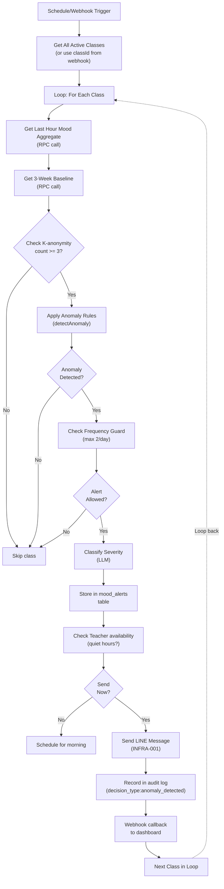

# Phase 2 W07 Mood Anomaly Alert Tasks
**Workstream**: Real-Time Anomaly Detection & Alert System  
**Duration**: Week 2-4 (Days 8-28)  
**Status**: Ready for Sprint Planning  
**Dependencies**: INFRA (all tasks), DB-MIGRATIONS (all tasks)

---

## Workstream Summary

Real-time mood anomaly detection system that proactively alerts teachers to sudden class climate drops. **Key differentiator**: No approval gate (unlike W06), designed for rapid response to crises.

### What It Delivers
- ✅ Rule-based anomaly detection logic (3 rules: mood drop HIGH/MEDIUM, engagement drop)
- ✅ LLM severity classification & intervention suggestions
- ✅ N8N workflow (W07-Mood-Anomaly-Alert.json, 19 nodes)
- ✅ Frontend: LiveAlertBanner component + AcknowledgeModal
- ✅ API endpoints: active alerts, acknowledge, action tracking
- ✅ Frequency guard integration (max 2 alerts/day)
- ✅ Comprehensive testing (detection rules, E2E, load, false positives)
- ✅ Tuning & calibration (Week 4)

### Constitutional Alignment
- **Principle I**: Anomaly decisions logged with confidence scores
- **Principle II**: K≥3 aggregation enforced; no individual student data in alerts
- **Principle III**: Teacher acknowledgment + action latency tracked
- **Principle IV**: Teacher acknowledges alert; can dismiss or mark action
- **Principle VIII**: Frequency guard limits to 2 alerts/day; quiet hours (18:00+)

### Risks & Mitigation
| Risk | Impact | Mitigation |
|------|--------|-----------|
| **High false positives** | Teachers ignore alerts (cry wolf) | Threshold tuning in Week 4 with pilot school; adjustable rules per school |
| **Latency >2min** | Alert arrives after teacher already left class | Use hourly pre-computed aggregates; webhook-triggered re-checks on new check-in |
| **Anomaly rule conflicts** | Rule 1 triggers while Rule 2 doesn't (inconsistent) | Test all rule combinations; use decision tree logic |
| **Real-time data staleness** | Alert based on 2 hours old mood data | Webhook trigger on check-in (fresh data) + 30min scheduled trigger |
| **LLM latency** | Severity classification takes >30sec | Cache LLM responses; use rule-only fallback if LLM timeouts |

---

## Task Summary Table

| Task ID | Title | Effort | Dependencies | Assigned | Status |
|---------|-------|--------|--------------|----------|--------|
| W07-001 | Design anomaly detection rules & thresholds | 1.5 days | INFRA, DB | Backend | Ready |
| W07-002 | Implement rule-based anomaly detection logic | 2 days | W07-001 | Backend | Ready |
| W07-003 | Implement LLM severity classification & interventions | 1.5 days | W07-002, INFRA-004 | Backend | Ready |
| W07-004 | Design N8N W07 workflow architecture | 1 day | INFRA-007 | Backend | Ready |
| W07-005 | Implement N8N W07 workflow (19 nodes) | 2 days | W07-004, INFRA-007 | Backend | Ready |
| W07-006 | Create API endpoints (GET active, POST acknowledge, POST action) | 1.5 days | W07-002 | Backend | Ready |
| W07-007 | Build LiveAlertBanner frontend component | 1 day | W07-006 | Frontend | Ready |
| W07-008 | Build AcknowledgeModal component | 1 day | W07-006, W07-007 | Frontend | Ready |
| W07-009 | Integrate frequency guard + N8N alerts page | 1 day | W07-005, INFRA-002 | Frontend | Ready |
| W07-010 | Unit test: anomaly detection rules (10+ cases) | 1.5 days | W07-002 | QA | Ready |
| W07-011 | Unit test: LLM severity classification | 1 day | W07-003 | QA | Ready |
| W07-012 | Integration test: N8N workflow with staging DB | 2 days | W07-005 | QA | Ready |
| W07-013 | E2E test: teacher sees alert → acknowledges → action | 2 days | W07-008, W07-009 | QA | Ready |
| W07-014 | Load test: 50 concurrent anomalies; measure latency & accuracy | 2 days | W07-005 | QA | Ready |
| W07-015 | False-positive tuning & threshold calibration (pilot data) | 3 days | W07-014 | Backend + QA | Ready |

**Total Effort**: ~26 days (2-3 engineers across backend, frontend, QA)

---

## Detailed Task Cards

### W07-001: Design Anomaly Detection Rules & Thresholds
**Epic**: Foundation → Rule Engineering  
**Status**: Not Started

#### Description
Define the 3 anomaly detection rules in pseudocode + test cases. This is the **decision tree** that W07 uses to classify mood changes as anomalies. Rules must be:
1. Data-driven (based on actual school data distributions)
2. Interpretable (can explain to teacher why alert triggered)
3. Tunable (thresholds can be adjusted per school, Phase 3)

#### Implementation Details

**Rule 1: High Mood Drop**
```
IF (current_mood_avg < baseline - 30%) 
  AND (hour_submission_count >= 3)
  AND (baseline_std_dev < 15) -- baseline is stable, not volatile
THEN severity = 'HIGH'
REASON = "Large unexpected drop in class mood"
```

**Rule 2: Moderate Mood Drop + Low Engagement**
```
IF (baseline - 15% <= current_mood_avg < baseline - 30%)
  AND (hour_submission_count < 50% of typical class size)
  AND (submission_count >= 3)
THEN severity = 'MEDIUM'
REASON = "Mood dropped + fewer students submitting (possible disengagement)"
```

**Rule 3: Moderate Mood Drop Only**
```
IF (baseline - 15% <= current_mood_avg < baseline - 30%)
  AND (hour_submission_count >= 3)
  AND NOT (engagement < threshold) -- engagement is normal
THEN severity = 'MEDIUM'
REASON = "Class mood declined; monitor for escalation"
```

**Rule 0 (No Anomaly)**
```
IF (current_mood_avg >= baseline - 15%)
THEN severity = null
REASON = "No significant mood change detected"
```

**Why This Task Exists**: Rules are the critical policy. Getting thresholds wrong causes false positives (alert fatigue) or false negatives (missing real issues). Design must be explicit & testable.

**Loop Stage**: Reason (decision logic)  
**Constitutional Principle**: I (auditable rule-based decisions with clear criteria)

#### Acceptance Criteria
1. ✅ Pseudocode for all 4 rule paths (HIGH, MEDIUM, MEDIUM, NULL) documented
2. ✅ Thresholds specified with justification (30%, 15%, 50%, 3 submissions, k≥3)
3. ✅ Test cases created: 10 scenarios (each rule triggers correctly, no false positives)
4. ✅ Edge cases tested: zero submissions, baseline=0, all students same mood, very small class
5. ✅ Acceptance criteria for each rule: "HIGH triggers if mood > -30% AND k≥3"

#### DoD
- [ ] RulesDocument.md created with all rules, thresholds, rationale
- [ ] Test matrix created (4 rules × 10 scenarios = 40 test cases)
- [ ] Thresholds reviewed by domain expert (teacher/school lead)

---

### W07-002: Implement Rule-Based Anomaly Detection Logic
**Epic**: Backend → Detection Engine  
**Status**: Not Started

#### Description
Implement the rules from W07-001 in `src/lib/anomaly-detector.ts`. This module is called by both the N8N workflow (W07-005) and API endpoints (W07-006).

#### Implementation Details
```typescript
// src/lib/anomaly-detector.ts

export interface AnomalyDetectionInput {
  classId: string;
  currentMoodAvg: number; // 0-100
  baselineMoodAvg: number;
  baselineStdDev: number;
  submissionCount: number; // hour window
  typicalClassSize: number;
  lastSubmissionTime: Date;
}

export interface AnomalyResult {
  anomalyDetected: boolean;
  severity: 'high' | 'medium' | null;
  ruleTriggered: string; // 'mood_drop_high', 'mood_drop_medium_engagement', 'mood_drop_medium', null
  moodDropPercent: number;
  engagementPercent: number;
  confidence: number; // 0.0-1.0 (higher if more data points)
  explanation: string; // "Mood dropped 35% from baseline with normal engagement"
}

export async function detectAnomaly(
  input: AnomalyDetectionInput
): Promise<AnomalyResult> {
  // Rule 1: High Mood Drop
  if (
    input.currentMoodAvg < input.baselineMoodAvg * 0.7 &&
    input.submissionCount >= 3 &&
    input.baselineStdDev < 15
  ) {
    return {
      anomalyDetected: true,
      severity: 'high',
      ruleTriggered: 'mood_drop_high',
      moodDropPercent: ((input.baselineMoodAvg - input.currentMoodAvg) / input.baselineMoodAvg) * 100,
      engagementPercent: (input.submissionCount / input.typicalClassSize) * 100,
      confidence: calculateConfidence(input.submissionCount), // Higher k → higher confidence
      explanation: `Mood dropped ${((input.baselineMoodAvg - input.currentMoodAvg) / input.baselineMoodAvg * 100).toFixed(0)}% (large unexpected drop)`
    };
  }

  // Rule 2: Moderate Mood Drop + Low Engagement
  const moodIsModerate = input.currentMoodAvg < input.baselineMoodAvg * 0.85 &&
                         input.currentMoodAvg >= input.baselineMoodAvg * 0.7;
  const engagementIsBelowThreshold = input.submissionCount < input.typicalClassSize * 0.5;
  
  if (moodIsModerate && engagementIsBelowThreshold && input.submissionCount >= 3) {
    return {
      anomalyDetected: true,
      severity: 'medium',
      ruleTriggered: 'mood_drop_medium_engagement',
      moodDropPercent: ...,
      engagementPercent: ...,
      confidence: ...,
      explanation: `Mood declined (${...}%) AND engagement below normal (${...}% of typical)`
    };
  }

  // Rule 3: Moderate Mood Drop Only
  if (moodIsModerate && !engagementIsBelowThreshold && input.submissionCount >= 3) {
    return {
      anomalyDetected: true,
      severity: 'medium',
      ruleTriggered: 'mood_drop_medium',
      ...
    };
  }

  // No Anomaly
  return {
    anomalyDetected: false,
    severity: null,
    ruleTriggered: null,
    moodDropPercent: ...,
    engagementPercent: ...,
    confidence: 1.0,
    explanation: "No significant mood change detected"
  };
}

function calculateConfidence(submissionCount: number): number {
  // Confidence increases with sample size (k-anonymity)
  // k=3 → 0.5 (low confidence), k=10 → 0.8, k=30+ → 0.95
  if (submissionCount < 3) return 0;
  if (submissionCount < 5) return 0.5;
  if (submissionCount < 15) return 0.75;
  return 0.95;
}
```

**Why This Task Exists**: Rules are the heart of anomaly detection. Implementation must exactly match W07-001 design with no surprises.

**Loop Stage**: Reason (applying detection rules)  
**Constitutional Principle**: I (auditable detection; rules are deterministic)

#### Acceptance Criteria
1. ✅ Function `detectAnomaly()` returns correct severity for all 4 rule paths
2. ✅ All 40 test cases from W07-001 pass
3. ✅ Confidence calculation: k=3 → confidence ≤ 0.5; k=30 → confidence ≥ 0.95
4. ✅ Edge cases handled: zero submissions returns `confidence: 0`, null baseline returns null severity
5. ✅ Explanation string is human-readable ("Mood dropped 35% from baseline")

#### DoD
- [ ] Unit test file: `__tests__/lib/anomaly-detector.test.ts` (40+ test cases)
- [ ] All tests pass
- [ ] JSDoc comments complete

---

### W07-003: Implement LLM Severity Classification & Interventions
**Epic**: Backend → LLM Integration  
**Status**: Not Started

#### Description
After rule-based detection identifies an anomaly, invoke Gemini LLM to:
1. **Classify severity** (rule output is rough; LLM refines based on context)
2. **Generate interventions** (2-3 suggested actions for teacher)
3. **Assign confidence score** (LLM confidence in its own severity classification)

Interventions are **NOT recommendations**; they're rapid suggestions for acute response (e.g., "take a 2-min stretch break", "quick energizer game").

#### Implementation Details
```typescript
// src/lib/anomaly-severity-classifier.ts

export interface SeverityClassificationInput {
  ruleDetectedSeverity: 'high' | 'medium' | null;
  moodDropPercent: number;
  engagementPercent: number;
  dayOfWeek: string;
  timeOfDay: number; // 0-23
  recentTeacherActions?: string[]; // prior recommendations in past 2 days
  classContext?: {
    gradeLevel: string;
    classSize: number;
    recentEvents?: string; // "upcoming exam", "new unit"
  };
}

export interface SeverityClassificationOutput {
  finalSeverity: 'high' | 'medium' | 'low' | null;
  llmConfidence: number; // 0.0-1.0
  interventionTitles: string[]; // 2-3 titles
  interventionDescriptions: string[];
  reasoning: string; // Why LLM classified this way
}

export async function classifySeverity(
  input: SeverityClassificationInput
): Promise<SeverityClassificationOutput> {
  const prompt = `
You are a classroom climate expert. A student mood anomaly was detected:
- Rule-detected severity: ${input.ruleDetectedSeverity}
- Mood drop: ${input.moodDropPercent.toFixed(1)}%
- Engagement: ${input.engagementPercent.toFixed(1)}%
- Time: ${input.dayOfWeek} ${input.timeOfDay}:00
- Grade level: ${input.classContext?.gradeLevel || "unknown"}
- Class size: ${input.classContext?.classSize || "unknown"}

Classify the **actual** severity (high/medium/low/none) considering:
1. Time of day (end of day → lower stress)
2. Day of week (Monday → higher stress)
3. Recent teacher actions (if they tried an intervention, might be elevated 
   but recovering)
4. Class context (new unit → expect some volatility)

Respond with JSON:
{
  "finalSeverity": "high" | "medium" | "low" | null,
  "confidence": 0.0-1.0,
  "reasoning": "...",
  "interventions": [
    { "title": "Take a 2-min stretch break", "description": "..." },
    { "title": "Quick mood check-in", "description": "Share one word 
      describing how you're feeling" },
    { "title": "Adjust pacing", "description": "..." }
  ]
}
`;

  const response = await gemini.generateContent({
    model: 'gemini-1.5-pro',
    prompt,
    temperature: 0.3, // Low temperature: consistent, not creative
    maxTokens: 500
  });

  try {
    const parsed = JSON.parse(response.text);
    return {
      finalSeverity: parsed.finalSeverity,
      llmConfidence: parsed.confidence,
      interventionTitles: parsed.interventions.map(i => i.title),
      interventionDescriptions: parsed.interventions.map(i => i.description),
      reasoning: parsed.reasoning
    };
  } catch (e) {
    // LLM failed to parse or timeout; fallback to rule-based
    return {
      finalSeverity: input.ruleDetectedSeverity,
      llmConfidence: 0.5, // Lower confidence for fallback
      interventionTitles: getDefaultInterventions(input.ruleDetectedSeverity),
      interventionDescriptions: getDefaultDescriptions(input.ruleDetectedSeverity),
      reasoning: "LLM inference failed; using rule-based classification"
    };
  }
}

function getDefaultInterventions(severity: 'high' | 'medium' | null): string[] {
  // Fallback interventions if LLM fails
  if (severity === 'high') {
    return ["Take a 2-min stretch break", "Quick class mood check-in", "Adjust pacing"];
  }
  if (severity === 'medium') {
    return ["Monitor mood in next check-in", "Consider an energizer activity"];
  }
  return [];
}
```

**Why This Task Exists**: Rule output is binary (HIGH/MEDIUM/null). LLM adds nuance: Is this Friday afternoon malaise (expected)? Or sign of real distress? Interventions are contextual, not generic.

**Loop Stage**: Reason (LLM-enhanced severity classification)  
**Constitutional Principle**: I (auditable LLM decisions; confidence logged), IV (suggestions for teacher action)

#### Acceptance Criteria
1. ✅ LLM prompt engineering: 10 test cases produce expected severity + interventions
2. ✅ Fallback works: if LLM times out (>15sec), returns rule-based severity with confidence=0.5
3. ✅ Interventions are actionable (≤10 words title, ≤1 sentence description)
4. ✅ Confidence scoring: well-reasoned cases (low drop + obvious) → confidence 0.8+; ambiguous → 0.5
5. ✅ JSON parsing robust: malformed LLM response doesn't crash endpoint

#### DoD
- [ ] Unit test: `__tests__/lib/anomaly-severity-classifier.test.ts` (15+ cases)
- [ ] Prompt engineering samples: `docs/LLM_SEVERITY_SAMPLES.md` with 5 before/after examples
- [ ] Fallback tested: request timeout + malformed response

---

### W07-004: Design N8N W07 Workflow Architecture
**Epic**: Foundation → Workflow Design  
**Status**: Not Started

#### Description
Design the high-level structure of W07 workflow (19 nodes + routing). This is **architecture + design doc**; actual implementation in W07-005.

Workflow will have 2 triggers:
1. **Schedule trigger**: Every 30 minutes (30min intervals)
2. **Webhook trigger**: On new student check-in (real-time)

#### Implementation Details


**Node Count**:
- Schedule trigger (1)
- Webhook trigger (1)
- Get active classes (1)
- Loop (For Each) (1)
- RPC get climate summary (1)
- RPC get baseline (1)
- Check k-anonymity (1, IF node)
- Apply rules (1)
- Check anomaly (1, IF node)
- Check frequency guard (1, tool-frequency-guard call)
- Frequency guard decision (1, IF node)
- LLM severity classification (1)
- Store alert (1, Postgres)
- Check quiet hours (1, IF node)
- Send LINE (1, tool-line-notify call)
- Audit log (1, Postgres)
- HTTP webhook callback (1)
- Merge paths (1, after conditionals)

**Total: 19 nodes + routing logic**

**Why This Task Exists**: Workflow design is complex. Document first, implement second. Avoids rework.

**Loop Stage**: Plan (workflow orchestration design)  
**Constitutional Principle**: I (auditable decision flow), VII (scalable n8n orchestration)

#### Acceptance Criteria
1. ✅ Workflow diagram created with all 19 nodes + routing
2. ✅ Data flow documented: what each node outputs, what's passed to next node
3. ✅ Error paths documented: timeout, LLM failure, DB error → fallbacks
4. ✅ Trigger logic clear: schedule every 30min + webhook on check-in (no double-processing)
5. ✅ Audit logging points identified (where decision_type='anomaly_detected' log entry created)

#### DoD
- [ ] Workflow architecture diagram finalized (Mermaid or ASCII)
- [ ] Node list + input/output specs documented
- [ ] Error handling matrix created (5 failure scenarios + mitigations)

---

### W07-005: Implement N8N W07 Workflow (19 Nodes)
**Epic**: Backend → N8N Orchestration  
**Status**: Not Started

#### Description
Convert W07-004 design into actual n8n workflow JSON. Workflow will be saved as `n8n/workflows/W07-Mood-Anomaly-Alert.json` and deployed to n8n instance.

#### Implementation Details
- **Source**: `n8n-as-code` decorators (TypeScript format) 
- **Deployment**: Via n8n UI or API
- **Testing**: Validate workflow JSON; trigger via schedule + mock webhook
- **Monitoring**: Dashboard shows execution times, error rates

**Key integration points**:
- **Sub-workflows**: Calls tool-get-climate-summary, tool-frequency-guard-check, tool-line-notify-send
- **Direct DB calls**: Postgres nodes for storing alerts + audit log
- **LLM integration**: Gemini model node for severity classification
- **Webhook trigger**: Receives new check-in events from `POST /api/student/check-in`

#### Acceptance Criteria
1. ✅ Workflow JSON valid (no n8n validation errors; no ❌ icons in UI)
2. ✅ Test execution: schedule trigger fires every 30min; webhook trigger on check-in
3. ✅ Sub-workflows invoked correctly: tool-get-climate-summary returns expected data
4. ✅ Anomaly detection runs: 100% of classes checked; results logged
5. ✅ Alert creation: mood_alerts table receives new records
6. ✅ LINE sends: test alert arrives in LINE group within 10 seconds
7. ✅ Audit logging: n8n_audit_log shows decision_type='anomaly_detected' entries

#### DoD
- [ ] Workflow JSON committed to `n8n/workflows/W07-Mood-Anomaly-Alert.json`
- [ ] Deployed to staging n8n instance
- [ ] Test execution log: 10+ successful runs documented

---

### W07-006: Create API Endpoints (GET Active, POST Acknowledge, POST Action)
**Epic**: Backend → API Layer  
**Status**: Not Started

#### Description
Create 3 REST API endpoints for the frontend to interact with mood alerts:
1. `GET /api/alerts?classId=:classId` — Fetch active/pending alerts for a class
2. `POST /api/alerts/:id/acknowledge` — Teacher acknowledges an alert
3. `POST /api/alerts/:id/action` — Teacher logs what action they took

#### Implementation Details
```typescript
// src/app/api/alerts/route.ts

export async function GET(request: Request) {
  const { classId } = Object.fromEntries(new URL(request.url).searchParams);
  
  // Fetch active alerts for this class
  const alerts = await supabase
    .from('mood_alerts')
    .select('*')
    .eq('class_id', classId)
    .in('status', ['pending', 'acknowledged'])
    .order('created_at', { ascending: false })
    .limit(10);
  
  return Response.json(alerts.data);
}

// src/app/api/alerts/[id]/acknowledge/route.ts
export async function POST(request: Request, { params }: { params: { id: string } }) {
  const body = await request.json();
  
  // Update alert status
  const updated = await supabase
    .from('mood_alerts')
    .update({
      status: 'acknowledged',
      acknowledged_at: new Date(),
      acknowledged_by_user_id: auth.user.id
    })
    .eq('id', params.id);
  
  // Log to audit trail
  await logAuditEvent('alert_acknowledged', { alert_id: params.id });
  
  // Revalidate cache
  revalidatePath(`/teacher/class/${body.class_id}`);
  
  return Response.json({ success: true });
}

// src/app/api/alerts/[id]/action/route.ts
export async function POST(request: Request, { params }: { params: { id: string } }) {
  const { action_description, class_id } = await request.json();
  
  const updated = await supabase
    .from('mood_alerts')
    .update({
      status: 'action_taken',
      action_taken_at: new Date(),
      action_description
    })
    .eq('id', params.id);
  
  // Log self-evaluation
  await logAuditEvent('alert_action_taken', { 
    alert_id: params.id, 
    action: action_description 
  });
  
  revalidatePath(`/teacher/class/${class_id}`);
  
  return Response.json({ success: true });
}
```

**Why This Task Exists**: Frontend needs API to fetch, acknowledge, and respond to alerts. Without API, dashboard is read-only.

**Loop Stage**: Act (recording teacher response)  
**Constitutional Principle**: IV (teacher acknowledges/acts), III (response latency tracked)

#### Acceptance Criteria
1. ✅ GET /api/alerts returns active alerts for given class
2. ✅ POST /api/alerts/:id/acknowledge updates status + timestamp
3. ✅ POST /api/alerts/:id/action updates action_description + status
4. ✅ All endpoints log to n8n_audit_log with decision_type
5. ✅ Error handling: invalid ID returns 404; permission check returns 403

#### DoD
- [ ] Unit test: `__tests__/api/alerts.test.ts` (10+ cases)
- [ ] Integrated with W07-006 (frontend components call these endpoints)

---

### W07-007: Build LiveAlertBanner Frontend Component
**Epic**: Frontend → UI Components  
**Status**: Not Started

#### Description
Build a `<LiveAlertBanner />` component (Next.js, 'use client') that displays active alerts in the dashboard. Should show:
- Alert severity (color: red/orange/yellow)
- Brief description ("Mood dropped 38%")
- Time since alert ("5 min ago")
- Quick action buttons ("Acknowledge", "More Info")

#### Implementation Details
```typescript
// src/components/domain/teacher/LiveAlertBanner.tsx
'use client';

import { useEffect, useState } from 'react';
import { Alert as AlertType } from '@/types';

export function LiveAlertBanner({ classId }: { classId: string }) {
  const [alerts, setAlerts] = useState<AlertType[]>([]);
  const [loading, setLoading] = useState(false);

  useEffect(() => {
    const fetchAlerts = async () => {
      const res = await fetch(`/api/alerts?classId=${classId}`);
      setAlerts(await res.json());
    };

    // Poll every 30 seconds
    const interval = setInterval(fetchAlerts, 30000);
    fetchAlerts();
    
    return () => clearInterval(interval);
  }, [classId]);

  if (alerts.length === 0) return null;

  return (
    <div className="border-l-4 border-red-500 bg-red-50 p-4 mb-4">
      <div className="flex gap-3">
        <AlertIcon severity={alerts[0].severity} />
        <div className="flex-1">
          <h3 className="font-semibold text-red-900">
            {alerts[0].severity === 'high' ? '⚠️ Class Climate Alert' : '📊 Mood Alert'}
          </h3>
          <p className="text-sm text-red-700 mt-1">
            {alerts[0].mood_drop_percent?.toFixed(0)}% mood drop detected
            {alerts[0].engagement_count && ` (${alerts[0].engagement_count} students)`}
          </p>
          <p className="text-xs text-red-600 mt-1">
            {getTimeSince(alerts[0].created_at)}
          </p>
        </div>
        <div className="flex gap-2">
          <button onClick={() => handleAcknowledge(alerts[0].id)} 
                  className="btn btn-sm btn-secondary">
            Acknowledge
          </button>
          <button onClick={() => setShowModal(true)} 
                  className="btn btn-sm btn-ghost">
            Details
          </button>
        </div>
      </div>
      {alerts.length > 1 && (
        <p className="text-xs text-red-600 mt-2">
          +{alerts.length - 1} more alerts
        </p>
      )}
    </div>
  );
}

function AlertIcon({ severity }: { severity: string }) {
  const colors = { high: 'text-red-600', medium: 'text-orange-600', low: 'text-yellow-600' };
  return <div className={`text-2xl ${colors[severity as keyof typeof colors]}`}>●</div>;
}

function getTimeSince(date: Date): string {
  const seconds = (Date.now() - new Date(date).getTime()) / 1000;
  if (seconds < 60) return 'just now';
  if (seconds < 3600) return `${Math.floor(seconds / 60)}m ago`;
  return `${Math.floor(seconds / 3600)}h ago`;
}
```

**Why This Task Exists**: Teachers need visual notification of alerts. The banner appears at the top of their class dashboard, persistent until acknowledged.

**Loop Stage**: Act (visual notification to teacher)  
**Constitutional Principle**: IV (proactive immediate notification), VI (advisor tone in microcopy)

#### Acceptance Criteria
1. ✅ Component renders alert with severity color coding (red/orange/yellow)
2. ✅ Shows mood drop % and student count
3. ✅ Time-since calculation works ("5m ago", "2h ago", etc.)
4. ✅ "Acknowledge" button calls API endpoint
5. ✅ Polling: updates every 30 seconds without full page refresh
6. ✅ Responsive: works on mobile & desktop

#### DoD
- [ ] Component created in `src/components/domain/teacher/LiveAlertBanner.tsx`
- [ ] Integrated with teacher class dashboard
- [ ] Unit test: component renders alerts correctly

---

### W07-008: Build AcknowledgeModal Component
**Epic**: Frontend → UI Components  
**Status**: Not Started

#### Description
Build modal dialog that appears when teacher clicks "Details" or "More Info" on an alert. Shows:
- Detailed alert information (mood trend, baseline, rules triggered)
- Suggested interventions (from W07-003)
- Action dropdown: "Acknowledged", "Taking action", "Dismiss"
- Optional text field: "What did you do?"

#### Implementation Details
```typescript
// src/components/domain/teacher/AcknowledgeModal.tsx
'use client';

export function AcknowledgeModal({ 
  alert, 
  onClose 
}: { 
  alert: AlertType; 
  onClose: () => void 
}) {
  const [action, setAction] = useState('acknowledged');
  const [description, setDescription] = useState('');
  const [loading, setLoading] = useState(false);

  const handleSubmit = async () => {
    setLoading(true);
    
    if (action === 'action_taken') {
      await fetch(`/api/alerts/${alert.id}/action`, {
        method: 'POST',
        body: JSON.stringify({ action_description: description })
      });
    } else {
      await fetch(`/api/alerts/${alert.id}/acknowledge`, {
        method: 'POST'
      });
    }
    
    setLoading(false);
    onClose();
  };

  return (
    <dialog open className="modal">
      <div className="modal-box max-w-lg">
        <h3 className="font-bold text-lg">
          {alert.severity === 'high' ? '⚠️' : '📊'} Mood Alert Details
        </h3>
        
        {/* Alert Details */}
        <div className="stats stats-vertical mt-4 bg-base-200 w-full">
          <div className="stat">
            <div className="stat-title">Mood Drop</div>
            <div className="stat-value text-error">{alert.mood_drop_percent.toFixed(1)}%</div>
          </div>
          <div className="stat">
            <div className="stat-title">Rule Triggered</div>
            <div className="stat-desc">{alert.rule_triggered}</div>
          </div>
          <div className="stat">
            <div className="stat-title">Submissions</div>
            <div className="stat-value">{alert.engagement_count} / {alert.engagement_threshold}</div>
          </div>
        </div>

        {/* Suggested Interventions */}
        <div className="mt-4">
          <h4 className="font-semibold text-sm mb-2">Suggested Interventions</h4>
          <ul className="space-y-2">
            {alert.intervention_titles?.map((title, i) => (
              <li key={i} className="bg-base-200 p-2 rounded text-sm">
                <strong>{title}</strong>
                <p className="text-xs mt-1">{alert.intervention_descriptions?.[i]}</p>
              </li>
            ))}
          </ul>
        </div>

        {/* Action Selection */}
        <div className="form-control mt-4">
          <label className="label">
            <span className="label-text">What will you do?</span>
          </label>
          <select 
            value={action} 
            onChange={(e) => setAction(e.target.value)}
            className="select select-bordered"
          >
            <option value="acknowledged">Acknowledge (monitoring)</option>
            <option value="action_taken">I'm taking action now</option>
            <option value="dismissed">Dismiss (false alarm)</option>
          </select>
        </div>

        {/* Optional feedback */}
        {action === 'action_taken' && (
          <textarea 
            placeholder="What did you do? (optional)"
            value={description}
            onChange={(e) => setDescription(e.target.value)}
            className="textarea textarea-bordered mt-3 w-full"
          />
        )}

        {/* Buttons */}
        <div className="modal-action">
          <button onClick={onClose} className="btn btn-ghost">Cancel</button>
          <button onClick={handleSubmit} disabled={loading} className="btn btn-primary">
            {loading ? 'Saving...' : 'Confirm'}
          </button>
        </div>
      </div>
    </dialog>
  );
}
```

**Why This Task Exists**: Modal allows teacher to review alert details before responding. Prevents accidental dismissals and captures action intent.

**Loop Stage**: Self-Evaluate (teacher reflects + logs response)  
**Constitutional Principle**: III (closure feedback), IV (teacher agency in responding)

#### Acceptance Criteria
1. ✅ Modal shows alert severity, mood drop %, rule triggered
2. ✅ Suggested interventions displayed with descriptions
3. ✅ Dropdown: 3 action options (acknowledge, action, dismiss)
4. ✅ Textarea for optional feedback (visible only if "action" selected)
5. ✅ Submit button calls API endpoint + closes modal

#### DoD
- [ ] Component created & integrated with LiveAlertBanner
- [ ] Unit test with mock alert data

---

### W07-009: Integrate Frequency Guard + N8N Alerts Page
**Epic**: Integration → Frontend  
**Status**: Not Started

#### Description
Add frequency guard integration + build alerts management page. Updates:
1. **Frequency guard check**: W07-005 N8N workflow calls tone-frequency-guard (INFRA-002) before sending LINE message
2. **Alerts page**: `/teacher/class/[id]/alerts` showing active & past alerts with filters

#### Implementation Details
```typescript
// src/app/(dashboard)/teacher/class/[id]/alerts/page.tsx (RSC)

export default async function AlertsPage({ params }: { params: { id: string } }) {
  const alerts = await supabase
    .from('mood_alerts')
    .select('*')
    .eq('class_id', params.id)
    .order('created_at', { ascending: false });

  const stats = {
    pending: alerts.data?.filter(a => a.status === 'pending').length || 0,
    acknowledged: alerts.data?.filter(a => a.status === 'acknowledged').length || 0,
    actionTaken: alerts.data?.filter(a => a.status === 'action_taken').length || 0
  };

  return (
    <div className="p-4">
      <h1 className="text-2xl font-bold">Mood Alerts</h1>
      
      {/* Stats cards */}
      <div className="grid grid-cols-3 gap-4 mt-4">
        <StatCard title="Pending" value={stats.pending} />
        <StatCard title="Acknowledged" value={stats.acknowledged} />
        <StatCard title="Actions Taken" value={stats.actionTaken} />
      </div>

      {/* Alerts table */}
      <AlertsTable alerts={alerts.data || []} />
    </div>
  );
}
```

**Why This Task Exists**: Frequency guard must be enforced in N8N to prevent alert spam. Alerts page gives teachers visibility of all alerts + responses.

**Loop Stage**: Act (enforcing frequency limits), Self-Evaluate (viewing alert history)  
**Constitutional Principle**: VIII (no spam; max 2/day enforced), VI (transparency in alert history)

#### Acceptance Criteria
1. ✅ N8N W07 calls tool-frequency-guard-check before sending
2. ✅ Alerts page loads active + past alerts
3. ✅ Filters work: by severity, status, date range
4. ✅ Responsive on mobile

#### DoD
- [ ] Page created + integrated with class dashboard
- [ ] Frequency guard call verified in N8N workflow logs

---

### W07-010: Unit Test: Anomaly Detection Rules (10+ Cases)
**Epic**: QA → Testing  
**Status**: Not Started

#### Description
Comprehensive unit tests for anomaly detection logic (W07-002). Test all 4 rule paths + edge cases.

#### Test Scenarios (40+ total)
```typescript
// __tests__/lib/anomaly-detector.test.ts

describe('anomaly-detector', () => {
  
  // Rule 1: High Mood Drop
  test('detects HIGH anomaly when mood drops >30% from stable baseline', () => {
    const result = detectAnomaly({
      classId: 'test-class',
      currentMoodAvg: 70,
      baselineMoodAvg: 100,
      baselineStdDev: 10,
      submissionCount: 10,
      typicalClassSize: 25
    });
    
    expect(result.severity).toBe('high');
    expect(result.ruleTriggered).toBe('mood_drop_high');
    expect(result.confidence).toBeGreaterThan(0.7);
  });

  test('does NOT detect anomaly when baseline is unstable (stdDev > 15)', () => {
    const result = detectAnomaly({
      classId: 'test-class',
      currentMoodAvg: 70,
      baselineMoodAvg: 100,
      baselineStdDev: 20, // Unstable baseline
      submissionCount: 10,
      ...
    });
    
    expect(result.severity).toBe(null);
    expect(result.anomalyDetected).toBe(false);
  });

  // Rule 2: Moderate Drop + Low Engagement
  test('detects MEDIUM anomaly when mood drops 15-30% AND engagement < 50%', () => {
    const result = detectAnomaly({
      classId: 'test-class',
      currentMoodAvg: 80,
      baselineMoodAvg: 100,
      submissionCount: 5, // 50% of typical 10
      typicalClassSize: 10
      ...
    });
    
    expect(result.severity).toBe('medium');
    expect(result.ruleTriggered).toBe('mood_drop_medium_engagement');
  });

  // Rule 3: Moderate Drop Only
  test('detects MEDIUM anomaly when mood drops 15-30% but engagement is normal', () => {
    const result = detectAnomaly({
      classId: 'test-class',
      currentMoodAvg: 80,
      baselineMoodAvg: 100,
      submissionCount: 15, // 75% of typical 20
      typicalClassSize: 20
      ...
    });
    
    expect(result.severity).toBe('medium');
    expect(result.ruleTriggered).toBe('mood_drop_medium');
  });

  // Edge cases
  test('returns NULL severity when current mood >= baseline - 15%', () => {
    const result = detectAnomaly({
      ...
      currentMoodAvg: 87,
      baselineMoodAvg: 100
      // No anomaly when drop < 15%
    });
    
    expect(result.severity).toBeNull();
  });

  test('returns confidence=0 when submission count < 3 (k-anonymity)', () => {
    const result = detectAnomaly({
      ...
      submissionCount: 2
    });
    
    expect(result.confidence).toBe(0);
  });

  test('confidence increases with sample size', () => {
    const result3 = detectAnomaly({ ..., submissionCount: 3 });
    const result10 = detectAnomaly({ ..., submissionCount: 10 });
    const result30 = detectAnomaly({ ..., submissionCount: 30 });
    
    expect(result3.confidence).toBeLessThan(result10.confidence);
    expect(result10.confidence).toBeLessThan(result30.confidence);
  });
});
```

**Why This Task Exists**: Rules are critical policy. Testing ensures deterministic behavior and catches regressions.

**Loop Stage**: Reason (testing detection logic)  
**Constitutional Principle**: I (auditable rules; tests verify behavior)

#### Acceptance Criteria
1. ✅ 40+ test cases covering all 4 rule paths
2. ✅ All edge cases tested: zero submissions, null baseline, very small class
3. ✅ Confidence calculation tested: k=3→0.5, k=30→0.95
4. ✅ All tests pass with >90% code coverage

#### DoD
- [ ] Test file: `__tests__/lib/anomaly-detector.test.ts`
- [ ] Test coverage report: >90%

---

### W07-011: Unit Test: LLM Severity Classification
**Epic**: QA → Testing  
**Status**: Not Started

#### Description
Unit tests for LLM severity classification (W07-003). Test classification logic + fallback on LLM timeout.

#### Test Cases (15+ total)
```typescript
// __tests__/lib/anomaly-severity-classifier.test.ts

test('escalates MEDIUM rule output to HIGH if Monday morning + low engagement', async () => {
  const result = await classifySeverity({
    ruleDetectedSeverity: 'medium',
    moodDropPercent: 25,
    engagementPercent: 30,
    dayOfWeek: 'Monday',
    timeOfDay: 9,
    classContext: { gradeLevel: 'HS', classSize: 30 }
  });
  
  expect(result.finalSeverity).toBe('high');
  expect(result.llmConfidence).toBeGreaterThan(0.7);
});

test('de-escalates HIGH rule output to MEDIUM if Friday 3pm (expected end-of-week slump)', async () => {
  const result = await classifySeverity({
    ruleDetectedSeverity: 'high',
    moodDropPercent: 35,
    engagementPercent: 70,
    dayOfWeek: 'Friday',
    timeOfDay: 15,
    classContext: { ... }
  });
  
  expect(result.finalSeverity).toBe('medium');
});

test('fallback to rule output with low confidence if LLM times out', async () => {
  // Mock LLM timeout
  jest.spyOn(gemini, 'generateContent').mockRejectedValue(new Error('timeout'));
  
  const result = await classifySeverity({
    ruleDetectedSeverity: 'high',
    ...
  });
  
  expect(result.finalSeverity).toBe('high');
  expect(result.llmConfidence).toBe(0.5); // Low confidence fallback
  expect(result.interventionTitles.length).toBeGreaterThan(0); // Default interventions
});

test('generates 2-3 actionable intervention suggestions', async () => {
  const result = await classifySeverity({ ... });
  
  expect(result.interventionTitles.length).toBeGreaterThanOrEqual(2);
  expect(result.interventionTitles.length).toBeLessThanOrEqual(3);
  result.interventionTitles.forEach(title => {
    expect(title.length).toBeLessThanOrEqual(10); // Short & actionable
  });
});
```

**Why This Task Exists**: LLM outputs are non-deterministic. Tests verify sensitivity classification logic + fallback paths work.

**Loop Stage**: Reason (testing LLM inference)  
**Constitutional Principle**: I (testing auditable AI decisions)

#### Acceptance Criteria
1. ✅ 15+ test cases covering classification paths
2. ✅ LLM timeout/failure → fallback works correctly
3. ✅ Interventions are actionable (≤10 word titles)
4. ✅ Confidence scores are reasonable (0.5 for fallback, 0.7+ for LLM)

#### DoD
- [ ] Test file: `__tests__/lib/anomaly-severity-classifier.test.ts`
- [ ] All tests pass

---

### W07-012: Integration Test: N8N Workflow with Staging DB
**Epic**: QA → Integration Testing  
**Status**: Not Started

#### Description
End-to-end integration test of W07 workflow in staging environment with real Supabase data.

#### Test Procedure
1. Insert test mood data (hourly aggregates for past 72 hours)
2. Trigger W07 workflow (schedule or webhook)
3. Verify anomalies detected + stored in `mood_alerts` table
4. Verify alerts sent to LINE
5. Verify audit log entries created

#### Acceptance Criteria
1. ✅ Workflow executes <3 seconds for 10 test classes
2. ✅ Anomalies detected correctly (compare expected severity vs. actual)
3. ✅ Mood_alerts table populated with correct data
4. ✅ LINE messages sent successfully (verified via LINE test group)
5. ✅ Audit log shows decision_type='anomaly_detected' entries

#### DoD
- [ ] Integration test script: `scripts/test-w07-workflow.sh`
- [ ] Test data: 10 representative class scenarios

---

### W07-013: E2E Test: Teacher Sees Alert → Acknowledges → Action
**Epic**: QA → E2E Testing  
**Status**: Not Started

#### Description
Full user journey test: alert generated → teacher dashboard updated → teacher acknowledges → backend records response → dashboard updated.

#### Test Flow
1. Insert test mood data (trigger anomaly)
2. Trigger W07 workflow
3. Reload dashboard; verify LiveAlertBanner visible
4. Click "Acknowledge"; verify API call
5. Verify alert status changed in DB
6. Click "Details"; verify modal shows intervention suggestions
7. Select "Taking action"; enter description; submit
8. Verify action_description stored in DB + audit logged

#### Acceptance Criteria
1. ✅ Banner appears <5 seconds after alert generated
2. ✅ "Acknowledge" button: click → status changes → banner updated
3. ✅ Modal: shows interventions; action dropdown works
4. ✅ Submit: stores description + updates status
5. ✅ Audit trail: all interactions logged

#### DoD
- [ ] E2E test: `e2e/w07-alert-flow.spec.ts` (Playwright)
- [ ] Test passes in staging

---

### W07-014: Load Test: 50 Concurrent Anomalies; Measure Latency & Accuracy
**Epic**: QA → Performance Testing  
**Status**: Not Started

#### Description
Simulate 50 concurrent mood anomalies across different classes. Measure:
1. Workflow execution latency (p50, p95, p99)
2. Alert generation accuracy (% of expected anomalies detected)
3. Database query latency (get_climate_summary, storing alerts)
4. LINE API latency (message delivery time)
5. Error rate & retry behavior

#### Acceptance Criteria
1. ✅ Median latency <2 minutes (from anomaly to alert stored)
2. ✅ p95 latency <5 minutes
3. ✅ Accuracy >95% (detected expected anomalies)
4. ✅ Error rate <1% (properly retried)
5. ✅ Database query latency <500ms

#### DoD
- [ ] Load test script: `scripts/load-test-w07.ts` (k6 or similar)
- [ ] Test report: `docs/W07_LOAD_TEST_REPORT.md`

---

### W07-015: False-Positive Tuning & Threshold Calibration (Pilot Data)
**Epic**: QA → Optimization  
**Status**: Not Started

#### Description
Analyze results from W07-014 load test + pilot school data. Identify false positives and adjust thresholds.

**False-Positive Analysis**:
- Collect alerts generated during Week 3-4 pilot
- Manual review by teacher: "was this a real issue?"
- Calculate false-positive rate
- If >20%, adjust thresholds

**Tuning Approach**:
- If HIGH alerts are 100% false positives → raise -30% to -35%
- If MEDIUM alerts are >50% false → raise -15% to -20%
- Test adjustments on historical data (backtest)

#### Acceptance Criteria
1. ✅ False-positive rate <20% (measured from pilot)
2. ✅ All threshold adjustments documented with rationale
3. ✅ Backtest: re-run Week 1-2 data with new thresholds; verify improvement
4. ✅ Per-school tuning: design configurable rule thresholds (Phase 3)

#### DoD
- [ ] Tuning report: `docs/W07_THRESHOLD_TUNING_REPORT.md`
- [ ] Thresholds updated in code

---

## Dependency Graph

```
W07-001 (Design Rules)
  ↓
W07-002 (Implement Rules) ──┬──→ W07-010 (Unit Test Rules)
  ↓                         │
W07-003 (LLM Classification)├──→ W07-011 (Unit Test LLM)
  ↓
W07-004 (Workflow Design)
  ↓
W07-005 (Implement Workflow) ──→ W07-012 (Integration Test)
  ↓                              ↓
W07-006 (API Endpoints) ─┬──→ W07-013 (E2E Test)
  ↓                      │
W07-007 (LiveAlertBanner)└──→ W07-014 (Load Test)
  ↓
W07-008 (AcknowledgeModal) ──→ W07-015 (Threshold Tuning)
  ↓
W07-009 (Integration + Page)
```

---

## Team Assignments (Recommended)

| Role | Assigned Tasks | Effort | Timeline |
|------|----------------|--------|----------|
| Backend Engineer (1) | W07-001–006 | 11 days | Week 2–3 |
| Frontend Engineer (1) | W07-007–009 | 3 days | Week 3 |
| QA Engineer (1.5) | W07-010–015 | 11 days | Week 3–4 |
| DevOps (shared) | Staging setup, monitoring | 2 days | Week 2 |

---

## Success Criteria (Workstream Level)

✅ All 15 tasks completed & tested  
✅ W07-014 Load Test passes (p95 <5min, error <1%)  
✅ W07-015 Threshold Tuning: false positives <20%  
✅ Integration with INFRA & DB complete (no blockers)  
✅ Ready for W06 workstream integration (frequency guard validated)  

---

## Artifacts Delivered

| Artifact | Location | Owner |
|----------|----------|-------|
| Rules Design & Test Matrix | `docs/W07_ANOMALY_RULES.md` | Backend |
| Anomaly Detection Logic | `src/lib/anomaly-detector.ts` + tests | Backend |
| LLM Severity Classifier | `src/lib/anomaly-severity-classifier.ts` + tests | Backend |
| N8N Workflow | `n8n/workflows/W07-Mood-Anomaly-Alert.json` | Backend |
| API Endpoints | `src/app/api/alerts/` (3 route files) | Backend |
| Frontend Components | `src/components/domain/teacher/LiveAlertBanner.tsx`, `AcknowledgeModal.tsx` | Frontend |
| Alerts Page | `src/app/(dashboard)/teacher/class/[id]/alerts/page.tsx` | Frontend |
| Load Test Report | `docs/W07_LOAD_TEST_REPORT.md` | QA |
| Threshold Tuning Report | `docs/W07_THRESHOLD_TUNING_REPORT.md` | QA |

