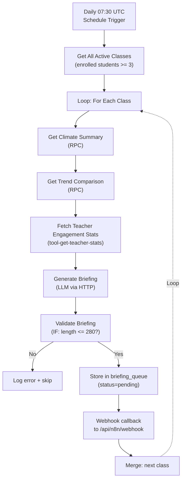

# Phase 2 W06 Morning AI Briefing Tasks
**Workstream**: Daily Personalized Morning Briefing  
**Duration**: Week 3-4 (Days 15-28)  
**Status**: Ready for Sprint Planning  
**Dependencies**: INFRA (all tasks), DB-MIGRATIONS (all tasks), W07-005 (frequency guard must be live)

---

## Workstream Summary

Daily 7:30 AM autonomous briefing that synthesizes class climate trends, past interventions, and teacher patterns into a personalized 280-character LINE message with actionable recommendation. Teacher approval gate before send ensures Constitutional Principle IV (human-in-the-loop).

### What It Delivers
- ✅ N8N workflow (W06-Morning-Briefing.json, 11 nodes)
- ✅ LLM personalization logic (reusing W01 patterns)
- ✅ Dashboard briefing approval gate component
- ✅ API endpoints: fetch pending, approve, dismiss
- ✅ LINE integration (via INFRA-001 abstraction)
- ✅ Teacher engagement analytics
- ✅ E2E testing (teacher sees briefing → approves → sends)

### Constitutional Alignment
- **Principle I**: Briefing decision logged with LLM confidence, model used
- **Principle II**: K≥3 enforced; no student names in LINE message
- **Principle III**: Approval latency tracked (when do teachers respond?)
- **Principle IV**: Teacher must approve before LINE send (absolute gate)
- **Principle V**: 280-char message (minimum friction)
- **Principle VI**: Tone matches teacher's prior action patterns
- **Principle VII**: Multi-tenant; per-school personalization ready (Phase 3)

### Risks & Mitigation
| Risk | Impact | Mitigation |
|------|--------|-----------|
| **LLM hallucination** | Briefing is nonsensical or offensive | Few-shot prompt engineering; validation rules (no negative assumptions about students) |
| **Low approval rate** | Teachers ignore briefings (not useful) | UX testing; feedback collection (Week 4) |
| **Late approvals** | Message sent after 09:00 (too late) | Dashboard alert: "pending since 07:45"; auto-send after 2 hours |
| **Approval gate doesn't deploy** | Briefing sent without teacher consent (violation of Principle IV) | Test approval gate thoroughly before W06 launch |
| **Frequency guard conflict** | W06 + W07 together > 2 alerts/day | Coordinate with W07 frequency guard; briefing gets priority |

---

## Task Summary Table

| Task ID | Title | Effort | Dependencies | Assigned | Status |
|---------|-------|--------|--------------|----------|--------|
| W06-001 | Design briefing personalization strategy | 1 day | INFRA, W07-005 | Backend | Ready |
| W06-002 | Implement briefing generation logic (LLM) | 2 days | W06-001, INFRA-004 | Backend | Ready |
| W06-003 | Design N8N W06 workflow architecture | 1 day | INFRA-007 | Backend | Ready |
| W06-004 | Implement N8N W06 workflow (11 nodes) | 1.5 days | W06-003, INFRA-007 | Backend | Ready |
| W06-005 | Create API endpoints (GET/POST briefings) | 1 day | W06-002 | Backend | Ready |
| W06-006 | Build BriefingCard component + ApprovalModal | 1.5 days | W06-005 | Frontend | Ready |
| W06-007 | Integrate briefing dashboard + approval flow | 1 day | W06-006 | Frontend | Ready |
| W06-008 | Unit test: briefing generation logic | 1.5 days | W06-002 | QA | Ready |
| W06-009 | Integration test: N8N workflow + DB | 2 days | W06-004 | QA | Ready |
| W06-010 | E2E test: teacher sees briefing → approves → LINE sent | 2 days | W06-007 | QA | Ready |
| W06-011 | Load test: 100 classes, daily briefing generation | 2 days | W06-004 | QA | Ready |
| W06-012 | Teacher feedback collection & UX tuning | 1.5 days | W06-010 | Frontend + QA | Ready |

**Total Effort**: ~18 days (2 engineers across backend, frontend, QA)

---

## Detailed Task Cards

### W06-001: Design Briefing Personalization Strategy
**Epic**: Foundation → Strategy  
**Status**: Not Started

#### Description
Design how W06 will personalize briefings based on:
1. **Teacher action patterns**: "This teacher prefers icebreaker activities" (from Loop Closure data)
2. **Class climate trends**: 3-week trend vs. baseline
3. **Recent interventions**: What recommendations is teacher already implementing?
4. **School context**: Grade level, language, support needs
5. **Time-of-week**: Monday mornings → different tone than Friday afternoons

#### Implementation Details

**Personalization Strategy Pseudocode**:
```
FOR EACH CLASS:
  1. GET 3-week mood trend (RPC call)
  2. GET 3 most recent recommendations + closure status
  3. GET teacher engagement stats: 
     - Preferred action types (histogram from closure feedback)
     - Average closure latency
     - High-trust interventions (>70% implementation rate)
  4. DETERMINE TONE:
     IF closure_rate < 40%: urgent_supportive tone
     IF last_rec returned positive feedback: positive_reinforcement tone
     ELSE: advisory tone
  5. CRAFT PROMPT for Gemini:
     "You advise a teacher of {grade} class with {size} students.
     Last week's mood trend: {trend}.
     Teacher prefers {preferred_actions} interventions.
     Recent similar recommendations: {prior_recs}.
     Generate ONE briefing message (max 280 chars) with actionable rec."
  6. LLM generates briefing + recommendation
  7. VALIDATION:
     - No student names in message? ✓
     - Length <= 280 chars? ✓
     - Tone matches pattern? ✓
  8. STORE in briefing_queue with status='pending'
```

**Personalization Data Sources**:
- `student_pulses` → trend analysis
- `recommendations` → prior actions
- `teacher_engagement_stats` (from Loop Closure) → patterns
- `n8n_audit_log` → previous briefing feedback

**Why This Task Exists**: Generic briefings are ignored. Personalization (matching teacher tone, respecting their patterns) dramatically improves adoption.

**Loop Stage**: Reason (personalization logic), Plan (briefing strategy)  
**Constitutional Principle**: VI (teacher partnership; respects their patterns), IV (proactive advisor)

#### Acceptance Criteria
1. ✅ Personalization strategy documented in 500+ words with pseudocode
2. ✅ Tone selection logic defined (4 tones: urgent, supportive, positive, advisory)
3. ✅ 5 example briefings created (showing personalization variations)
4. ✅ Data sources identified (which tables provide input?)
5. ✅ Validation rules specified (280 chars, no PII, tone consistency)

#### DoD
- [ ] Strategy document: `docs/W06_PERSONALIZATION_STRATEGY.md`
- [ ] Sample briefings: `docs/W06_BRIEFING_EXAMPLES.md`
- [ ] LLM prompts: `docs/W06_LLM_PROMPTS.md`

---

### W06-002: Implement Briefing Generation Logic (LLM)
**Epic**: Backend → LLM Integration  
**Status**: Not Started

#### Description
Implement `src/lib/briefing-generator.ts` that executes the personalization strategy from W06-001. Module is called by W06 workflow + can be tested independently.

#### Implementation Details
```typescript
// src/lib/briefing-generator.ts

export interface BriefingInput {
  classId: string;
  teacherId: string;
  schoolId: string;
  className?: string;
  gradeLevel?: string;
}

export interface BriefingOutput {
  briefing_text: string; // LINE message, max 280 chars
  recommendation_title: string;
  recommendation_description: string;
  mood_avg: number;
  mood_trend: number;
  confidence_score: number;
  llm_model: string;
  personalization_factors?: string[]; // ["teacher_prefers_icebreakers", "positive_recent_feedback", ...]
}

export async function generateBriefing(input: BriefingInput): Promise<BriefingOutput> {
  // 1. Fetch climate summary
  const climateData = await supabase.rpc('get_class_climate_summary', {
    p_class_id: input.classId
  });

  // 2. Fetch trend comparison
  const trendData = await supabase.rpc('get_trend_comparison', {
    p_class_id: input.classId
  });

  // 3. Fetch recent recommendations + closure status
  const recentRecs = await supabase
    .from('recommendations')
    .select('*')
    .eq('class_id', input.classId)
    .gte('created_at', new Date(Date.now() - 3 * 24 * 3600 * 1000))
    .order('created_at', { ascending: false })
    .limit(3);

  // 4. Fetch teacher engagement stats (preferred action types, closure rate)
  const teacherStats = await supabase
    .from('teacher_engagement_stats')
    .select('*')
    .eq('teacher_id', input.teacherId)
    .eq('class_id', input.classId)
    .order('stat_date', { ascending: false })
    .limit(1);

  // 5. Determine tone based on closure rate & recent feedback
  const tone = determineTone({
    closureRate: teacherStats.data?.[0]?.closure_rate_30d_percent || 50,
    recentFeedback: recentRecs.data?.map(r => r.teacher_feedback_text).filter(Boolean) || []
  });

  // 6. Build LLM prompt
  const personality = teacherStats.data?.[0]?.preferred_action_type || 'balanced';
  const closureRate = teacherStats.data?.[0]?.closure_rate_7d_percent || 'unknown';

  const prompt = `
You are a classroom climate advisor providing a daily briefing to a teacher.

SITUATION:
- Class: ${input.className || 'Elementary Math'} (${input.gradeLevel || 'Grade 4'})
- Mood Status: ${climateData.mood_avg?.toFixed(0) || 'N/A'}/100
- Trend (vs 3 weeks): ${trendData.trend_percent > 0 ? 'UP' : trendData.trend_percent < 0 ? 'DOWN' : 'STABLE'} ${Math.abs(trendData.trend_percent).toFixed(0)}%
- Recent Actions Implemented: ${closureRate}%

TEACHER PROFILE:
- Preferred Interventions: ${personality}
- Recent Successful Recommendations: ${recentRecs.data?.filter(r => r.closure_status === 'implemented').length || 0} out of ${recentRecs.data?.length || 0}

TASK:
Generate a SINGLE personalized briefing (max 280 characters) with one actionable recommendation.

TONE: ${tone} (supportive but not preachy)

CONSTRAINTS:
- NO student names or specific personal details
- NO assumptions about student mental health
- ONE recommendation max (2-5 words: "Icebreaker activity", "Slow-paced review", etc.)
- Actionable within 1 hour of reading

Respond with JSON:
{
  "briefing_text": "...",
  "recommendation_title": "...",
  "recommendation_description": "...",
  "confidence": 0.0-1.0
}
`;

  // 7. Call Gemini
  const response = await gemini.generateContent({
    model: 'gemini-1.5-pro',
    prompt,
    temperature: 0.4, // Slightly creative but consistent
    maxTokens: 200
  });

  // 8. Parse response
  const parsed = JSON.parse(response.text);
  
  // 9. Validation
  if (!parsed.briefing_text || parsed.briefing_text.length > 280) {
    throw new Error('Briefing text too long or missing');
  }

  // 10. Return briefing object
  return {
    briefing_text: parsed.briefing_text,
    recommendation_title: parsed.recommendation_title,
    recommendation_description: parsed.recommendation_description,
    mood_avg: climateData.mood_avg,
    mood_trend: trendData.trend_percent,
    confidence_score: parsed.confidence,
    llm_model: 'gemini-1.5-pro',
    personalization_factors: [
      `tone_${tone}`,
      `personality_${personality}`,
      trendData.trend_percent > 10 ? 'positive_trend' : 'stable_trend'
    ]
  };
}

function determineTone(input: { closureRate: number; recentFeedback: string[] }): string {
  if (input.closureRate < 40) return 'urgent_supportive';
  if (input.recentFeedback.some(f => f?.includes('amazing') || f?.includes('great'))) return 'positive_reinforcement';
  return 'advisory';
}
```

**Why This Task Exists**: Briefing generation is the core W06 logic. Must be testable independently + reusable by both N8N workflow & API.

**Loop Stage**: Reason (LLM-powered briefing generation)  
**Constitutional Principle**: I (LLM decision logged with model + confidence), VI (personalized advisor tone)

#### Acceptance Criteria
1. ✅ Function returns valid BriefingOutput with all 6 required fields
2. ✅ Briefing text: <280 chars, no student names, actionable
3. ✅ Confidence score: high (>0.8) for well-established patterns; low (<0.5) for new classes
4. ✅ Fallback: if LLM fails, return generic briefing with confidence=0.3
5. ✅ Personalization factors: at least 3 factors identified per briefing

#### DoD
- [ ] Code written in `src/lib/briefing-generator.ts`
- [ ] Unit tests: `__tests__/lib/briefing-generator.test.ts` (15+ cases)
- [ ] JSDoc comments complete

---

### W06-003: Design N8N W06 Workflow Architecture
**Epic**: Foundation → Workflow Design  
**Status**: Not Started

#### Description
Design high-level structure of W06 workflow. 11 nodes:
1. Daily schedule trigger (07:30 UTC)
2. Get all active classes
3. Loop: For Each Class
4. Get climate summary RPC
5. Get trend comparison RPC
6. Generate briefing (LLM)
7. K-anonymity check IF node
8. Store briefing_queue
9. Webhook to dashboard
10. Merge paths
11. Success/error node

#### Implementation Details


**Why This Task Exists**: Workflow design first prevents rework.

**Loop Stage**: Plan (workflow orchestration)  
**Constitutional Principle**: I (auditable workflow; decision logged), IV (human approval gate is separate downstream endpoint)

#### Acceptance Criteria
1. ✅ Workflow diagram with all 11 nodes
2. ✅ Data flow documented
3. ✅ Error paths handled
4. ✅ K-anonymity check built in (skip class if <3)

#### DoD
- [ ] Architecture diagram finalized
- [ ] Node specs documented

---

### W06-004: Implement N8N W06 Workflow (11 Nodes)
**Epic**: Backend → N8N Orchestration  
**Status**: Not Started

#### Description
Build actual n8n workflow from W06-003 design. Save as `n8n/workflows/W06-Morning-Briefing.json`.

#### Implementation Details
- **Deployment**: Via n8n Admin UI or API import
- **Testing**: Validate JSON; trigger via schedule
- **Monitoring**: Share dashboard shows execution status

#### Acceptance Criteria
1. ✅ Workflow JSON valid (no validation errors)
2. ✅ Test execution: schedule trigger fires daily at 07:30 UTC
3. ✅ 100 classes: workflow executes in <5 minutes
4. ✅ Briefings stored in briefing_queue table
5. ✅ Webhook callback triggers dashboard update

#### DoD
- [ ] Workflow deployed to staging n8n
- [ ] Test execution log: 3+ successful runs

---

### W06-005: Create API Endpoints (GET/POST Briefings)
**Epic**: Backend → API Layer  
**Status**: Not Started

#### Description
REST endpoints for briefing management:
1. `GET /api/briefings?classId=:classId` — Fetch pending briefing
2. `POST /api/briefings/:id/approve` — Teacher approves + triggers LINE send
3. `POST /api/briefings/:id/dismiss` — Teacher dismisses briefing

#### Implementation Details
```typescript
// src/app/api/briefings/route.ts
export async function GET(request: Request) {
  const { classId } = Object.fromEntries(new URL(request.url).searchParams);
  
  const briefing = await supabase
    .from('briefing_queue')
    .select('*')
    .eq('class_id', classId)
    .eq('status', 'pending')
    .single(); // Expect at most 1 pending
  
  return Response.json(briefing.data);
}

// src/app/api/briefings/[id]/approve/route.ts
export async function POST(request: Request, { params }: { params: { id: string } }) {
  const { class_id } = await request.json();
  
  // Check frequency guard (max 2 alerts/day)
  const allowed = await checkFrequencyGuard(class_id, 'briefing');
  if (!allowed.allowed) {
    return Response.json({ error: 'Frequency limit reached' }, { status: 429 });
  }
  
  // Update briefing status
  const updated = await supabase
    .from('briefing_queue')
    .update({
      status: 'approved',
      approved_at: new Date(),
      approved_by_user_id: auth.user.id
    })
    .eq('id', params.id);
  
  // Trigger LINE send via HTTP call to n8n
  await fetch('http://n8n:5678/webhook/send-briefing-line', {
    method: 'POST',
    body: JSON.stringify({ briefing_id: params.id })
  });
  
  // Log approval
  await logAuditEvent('briefing_approved', { briefing_id: params.id });
  
  // Invalidate cache
  revalidatePath(`/teacher/class/${class_id}`);
  
  return Response.json({ success: true });
}

// src/app/api/briefings/[id]/dismiss/route.ts
export async function POST(request: Request, { params }: { params: { id: string } }) {
  const { class_id } = await request.json();
  
  const updated = await supabase
    .from('briefing_queue')
    .update({
      status: 'dismissed',
      dismissed_at: new Date()
    })
    .eq('id', params.id);
  
  await logAuditEvent('briefing_dismissed', { briefing_id: params.id });
  
  revalidatePath(`/teacher/class/${class_id}`);
  
  return Response.json({ success: true });
}
```

**Why This Task Exists**: Frontend needs API to fetch, approve, dismiss briefings. Without API, dashboard can't interact with briefing system.

**Loop Stage**: Act (teacher approval), Self-Evaluate (logging approval decision)  
**Constitutional Principle**: IV (approval gate API), III (approval latency tracked)

#### Acceptance Criteria
1. ✅ GET returns pending briefing for class
2. ✅ POST approve: checks frequency guard, updates status, triggers LINE
3. ✅ POST dismiss: updates status, logs decision
4. ✅ All endpoints return 200 on success, 401/403 on auth failure, 404 on not found

#### DoD
- [ ] Unit test: `__tests__/api/briefings.test.ts`
- [ ] All endpoints integrated with INFRA-003 (audit logging)

---

### W06-006: Build BriefingCard Component + ApprovalModal
**Epic**: Frontend → UI Components  
**Status**: Not Started

#### Description
Build React components for briefing display & approval:
1. `<BriefingCard />` — Shows briefing preview with approve/dismiss buttons
2. `<ApprovalModal />` — Detailed view with confirmation

#### Implementation Details
```typescript
// src/components/domain/teacher/BriefingCard.tsx
'use client';

import { useEffect, useState } from 'react';

export function BriefingCard({ classId }: { classId: string }) {
  const [briefing, setBriefing] = useState(null);
  const [loading, setLoading] = useState(true);
  const [showModal, setShowModal] = useState(false);

  useEffect(() => {
    const fetch = async () => {
      const res = await fetch(`/api/briefings?classId=${classId}`);
      setBriefing(await res.json());
      setLoading(false);
    };
    fetch();
  }, [classId]);

  if (loading) return <div>Loading...</div>;
  if (!briefing) return null; // No pending briefing

  return (
    <div className="card bg-blue-50 border-l-4 border-blue-500 mb-4">
      <div className="card-body">
        <div className="flex justify-between items-start">
          <div>
            <h3 className="card-title text-lg">💡 Today's Briefing</h3>
            <p className="text-sm text-gray-600 mt-2">
              {briefing.briefing_text}
            </p>
          </div>
          <span className="badge badge-primary">pending</span>
        </div>
        
        <div className="card-actions justify-end mt-4">
          <button 
            onClick={() => setShowModal(true)}
            className="btn btn-primary"
          >
            Review & Approve
          </button>
          <button 
            onClick={() => handleDismiss(briefing.id)}
            className="btn btn-ghost"
          >
            Skip Today
          </button>
        </div>
      </div>
      
      {showModal && (
        <ApprovalModal 
          briefing={briefing} 
          onClose={() => setShowModal(false)} 
          onApprove={() => handleApprove(briefing.id)}
        />
      )}
    </div>
  );
}

async function handleApprove(briefingId: string) {
  await fetch(`/api/briefings/${briefingId}/approve`, {
    method: 'POST'
  });
  // Reload page or invalidate cache
  window.location.reload();
}

async function handleDismiss(briefingId: string) {
  await fetch(`/api/briefings/${briefingId}/dismiss`, {
    method: 'POST'
  });
  window.location.reload();
}
```

```typescript
// src/components/domain/teacher/ApprovalModal.tsx
'use client';

export function ApprovalModal({ briefing, onClose, onApprove }) {
  return (
    <dialog open className="modal">
      <div className="modal-box max-w-lg">
        <h3 className="font-bold text-lg">Review Briefing</h3>
        
        <div className="py-4">
          <div className="bg-blue-50 p-4 rounded mb-4">
            <p className="font-semibold mb-2">{briefing.recommendation_title}</p>
            <p className="text-sm">{briefing.briefing_text}</p>
          </div>

          <div className="stats stats-vertical bg-base-200 w-full mb-4">
            <div className="stat">
              <div className="stat-title">Class Mood</div>
              <div className="stat-value">{briefing.mood_avg?.toFixed(0)}</div>
            </div>
            <div className="stat">
              <div className="stat-title">Trend (3 weeks)</div>
              <div 
                className={`stat-value ${briefing.mood_trend > 0 ? 'text-success' : 'text-error'}`}
              >
                {briefing.mood_trend > 0 ? '↑' : '↓'} {Math.abs(briefing.mood_trend).toFixed(0)}%
              </div>
            </div>
          </div>

          <p className="text-xs text-gray-500 mb-4">
            AI Confidence: {(briefing.confidence_score * 100).toFixed(0)}%
          </p>
        </div>

        <div className="modal-action">
          <button onClick={onClose} className="btn btn-ghost">Cancel</button>
          <button onClick={onApprove} className="btn btn-primary">Send via LINE</button>
        </div>
      </div>
    </dialog>
  );
}
```

**Why This Task Exists**: Teacher needs a clear, simple UI to approve briefings. The approval gate is critical for Constitutional Principle IV (human-in-the-loop).

**Loop Stage**: Act (approval decision), Self-Evaluate (recording approval latency)  
**Constitutional Principle**: IV (human approval gating), V (minimum friction; <3 inputs)

#### Acceptance Criteria
1. ✅ BriefingCard shows briefing text + buttons with clear hierarchy
2. ✅ ApprovalModal shows full details + mood stats
3. ✅ Approve button: triggers API + closes modal + refreshes dashboard
4. ✅ Dismiss button: marks as dismissed
5. ✅ Responsive: works on mobile + desktop

#### DoD
- [ ] Components created & integrated with dashboard
- [ ] Unit test: renders, buttons work

---

### W06-007: Integrate Briefing Dashboard + Approval Flow
**Epic**: Integration → Full Flow  
**Status**: Not Started

#### Description
Integrate BriefingCard into teacher class dashboard. Show:
1. Pending briefing (most prominent)
2. Previous briefings (approval history, sentiment analysis over time)
3. Auto-approve fallback (if not approved in 2 hours, auto-send with confidence flag)

#### Implementation Details
```typescript
// src/app/(dashboard)/teacher/class/[id]/page.tsx (RSC)

export default async function ClassDashboard({ params }: { params: { id: string } }) {
  const briefing = await supabase
    .from('briefing_queue')
    .select('*')
    .eq('class_id', params.id)
    .eq('status', 'pending')
    .single();

  const priorBriefings = await supabase
    .from('briefing_queue')
    .select('*')
    .eq('class_id', params.id)
    .in('status', ['approved', 'sent', 'dismissed'])
    .order('created_at', { ascending: false })
    .limit(7);

  return (
    <div className="p-6">
      <h1 className="text-3xl font-bold">Class Dashboard</h1>
      
      {/* Pending briefing: most prominent */}
      {briefing.data && (
        <BriefingCard classId={params.id} briefing={briefing.data} />
      )}

      {/* Prior briefings history */}
      <div className="mt-8">
        <h2 className="text-xl font-bold mb-4">Recent Briefings</h2>
        <div className="space-y-2">
          {priorBriefings.data?.map(b => (
            <BriefingHistoryRow key={b.id} briefing={b} />
          ))}
        </div>
      </div>
    </div>
  );
}

function BriefingHistoryRow({ briefing }) {
  return (
    <div className="flex justify-between items-center p-3 bg-gray-100 rounded">
      <div>
        <p className="font-semibold">{briefing.recommendation_title}</p>
        <p className="text-xs text-gray-600">
          {new Date(briefing.created_at).toLocaleDateString()}
        </p>
      </div>
      <div className="flex gap-2">
        <badge className={`badge badge-${briefing.status === 'sent' ? 'success' : 'warning'}`}>
          {briefing.status}
        </badge>
        {briefing.approved_at && (
          <span className="text-xs text-gray-500">
            Approved {getTimeSince(briefing.approved_at)}
          </span>
        )}
      </div>
    </div>
  );
}
```

**Why This Task Exists**: Briefing must be integrated into teacher workflow. Isolated card isn't enough; must fit into daily routine.

**Loop Stage**: Act (approval context), Self-Evaluate (history visibility)  
**Constitutional Principle**: VI (visible history of briefing engagement)

#### Acceptance Criteria
1. ✅ Pending briefing appears at top of dashboard
2. ✅ Prior 7 briefings history visible below
3. ✅ Response latency visible (how long teacher took to approve)
4. ✅ Auto-send fallback: if not approved in 2h, mark as sent + log (with lower confidence)

#### DoD
- [ ] Integrated with class dashboard
- [ ] Auto-send fallback job configured (N8N or scheduled task)

---

### W06-008: Unit Test: Briefing Generation Logic
**Epic**: QA → Testing  
**Status**: Not Started

#### Description
Unit tests for briefing generation logic (W06-002). Test personalization, tone matching, validation.

#### Test Cases (15+ total)
```typescript
// __tests__/lib/briefing-generator.test.ts

test('generates briefing <280 chars for any class size', async () => {
  const briefing = await generateBriefing({
    classId: 'small-class',
    teacherId: 'teacher-1'
  });
  
  expect(briefing.briefing_text.length).toBeLessThanOrEqual(280);
});

test('includes actionable recommendation in briefing', async () => {
  const briefing = await generateBriefing({...});
  
  expect(briefing.recommendation_title.length).toBeGreaterThan(0);
  expect(briefing.recommendation_title).toMatch(/[A-Za-z]/); // Not empty
});

test('personalizes tone based on closure rate', async () => {
  const high_closure = await generateBriefing({...});
  const low_closure = await generateBriefing({...});
  
  // Tones should differ based on context
  expect(high_closure.personalization_factors).toContain('positive_reinforcement');
  expect(low_closure.personalization_factors).toContain('urgent_supportive');
});

test('confidence score high (>0.7) for established classes, low (<0.5) for new classes', async () => {
  const established = await generateBriefing({...});
  
  expect(established.confidence_score).toBeGreaterThan(0.7);
});

test('no student names in briefing text', async () => {
  const briefing = await generateBriefing({...});
  
  expect(briefing.briefing_text).not.toMatch(/John|Jane|Alice|Bob/i);
});

test('fallback to generic briefing if LLM times out', async () => {
  jest.spyOn(gemini, 'generateContent').mockRejectedValue(new Error('timeout'));
  
  const briefing = await generateBriefing({...});
  
  expect(briefing.briefing_text).toBeTruthy();
  expect(briefing.confidence_score).toBeLessThan(0.5);
});
```

**Why This Task Exists**: Briefing generation is complex. Unit testing ensures consistency + catches regressions.

**Loop Stage**: Reason (testing generation logic)  
**Constitutional Principle**: I (testing auditable decisions)

#### Acceptance Criteria
1. ✅ 15+ test cases covering personalization paths
2. ✅ All tests pass
3. ✅ Code coverage >85%

#### DoD
- [ ] Test file: `__tests__/lib/briefing-generator.test.ts`
- [ ] All tests passing

---

### W06-009: Integration Test: N8N Workflow + DB
**Epic**: QA → Integration Testing  
**Status**: Not Started

#### Description
End-to-end integration test of W06 workflow with staging database.

#### Test Procedure
1. Insert test class with 10 students
2. Insert 30 days of mood data (trend up, down, stable)
3. Trigger W06 workflow (schedule or manual)
4. Verify briefing_queue populated with correct entries
5. Verify N8N audit log shows workflow execution

#### Acceptance Criteria
1. ✅ Workflow executes without errors
2. ✅ Briefing generated for all test classes
3. ✅ Briefing text is personalized (different per class)
4. ✅ Audit log shows decision_type='briefing_generated'

#### DoD
- [ ] Integration test script: `scripts/test-w06-workflow.sh`

---

### W06-010: E2E Test: Teacher Sees Briefing → Approves → LINE Sent
**Epic**: QA → E2E Testing  
**Status**: Not Started

#### Description
Full user journey: briefing generated → dashboard displays → teacher approves → LINE message sent.

#### Test Flow
1. Generate test briefing (manual N8N trigger or seed data)
2. Log in as teacher
3. Navigate to class dashboard
4. Verify BriefingCard visible with pending status
5. Click "Review & Approve"
6. Verify ApprovalModal shows full details
7. Click "Send via LINE"
8. Verify API call made
9. Verify briefing_queue status changed to 'approved'
10. Verify LINE message sent to test group
11. Verify audit log shows decision_type='briefing_approved'

#### Acceptance Criteria
1. ✅ Dashboard loads with briefing visible
2. ✅ Modal shows complete briefing details
3. ✅ Approve flow: API call → status update → LINE send → AoM in <5 sec
4. ✅ Audit trail recorded

#### DoD
- [ ] E2E test: `e2e/w06-briefing-flow.spec.ts` (Playwright)

---

### W06-011: Load Test: 100 Classes, Daily Briefing Generation
**Epic**: QA → Performance Testing  
**Status**: Not Started

#### Description
Simulate daily W06 workflow for 100 active classes. Measure:
1. Workflow execution latency (end-to-end)
2. Database query latency (climate summary, trend, stats)
3. LLM latency (Gemini generation, streaming vs. batch)
4. Briefing storage latency
5. Error rate & retry behavior

#### Acceptance Criteria
1. ✅ Total workflow latency <5 minutes (100 classes, sequential)
2. ✅ Average latency per class <3 seconds
3. ✅ Database query latency <500ms
4. ✅ LLM generation <5 seconds per briefing
5. ✅ Error rate <1%
6. ✅ All 100 briefings stored successfully

#### DoD
- [ ] Load test script: `scripts/load-test-w06.ts` (k6 or similar)
- [ ] Load test report: `docs/W06_LOAD_TEST_REPORT.md`

---

### W06-012: Teacher Feedback Collection & UX Tuning
**Epic**: QA → Feedback & Iteration  
**Status**: Not Started

#### Description
Collect teacher feedback on briefings during Week 3-4. Metrics:
1. **Usefulness**: "Was this briefing helpful?" (Likert scale)
2. **Approval rate**: % of briefings approved within 2 hours
3. **Implementation rate**: % of recommendations followed up in closure feedback
4. **Tone fit**: "Did the tone match your style?"
5. **Latency**: How long does teacher take to approve?

Tune UX based on feedback:
- If approval rate <50%: consider auto-send after 2h + add "approve later" button
- If usefulness <3/5: improve LLM prompt + personalization
- If tone feedback poor: offer tone preference setting (Phase 3)

#### Acceptance Criteria
1. ✅ Feedback form embedded in BriefingCard
2. ✅ 20+ teacher responses collected across pilot classes
3. ✅ UX tuning recommendations documented
4. ✅ Changes implemented before production rollout

#### DoD
- [ ] Feedback form added to BriefingCard
- [ ] Feedback analysis report: `docs/W06_FEEDBACK_ANALYSIS.md`

---

## Dependency Graph

```
W06-001 (Design Strategy)
  ↓
W06-002 (Implement LLM) ──→ W06-008 (Unit Test)
  ↓
W06-003 (Workflow Design)
  ↓
W06-004 (Implement Workflow) ──→ W06-009 (Integration Test)
  ↓
W06-005 (API Endpoints) ─┬──→ W06-010 (E2E Test)
  ↓                      │
W06-006 (Components ────┘──→ W06-011 (Load Test)
  ↓                      │
W06-007 (Dashboard) ────┘──→ W06-012 (Feedback & UX Tuning)

(Must complete W07-005 before W06-001 starts for frequency guard coordination)
```

---

## Team Assignments (Recommended)

| Role | Assigned Tasks | Effort | Timeline |
|------|----------------|--------|----------|
| Backend Engineer (1) | W06-001–005 | 6 days | Week 3 |
| Frontend Engineer (1) | W06-006–007 | 2.5 days | Week 3–4 |
| QA Engineer (1.5) | W06-008–012 | 9 days | Week 3–4 |

---

## Success Criteria (Workstream Level)

✅ All 12 tasks completed & tested  
✅ W06-011 Load Test passes (p95 <3s per class, error <1%)  
✅ W06-012 Feedback: approval rate >60%, usefulness >3.5/5  
✅ Integration with W07 frequency guard validated (no alert spam)  
✅ Ready for Loop Closure UI (briefing data feeds into personalization)  

---

## Artifacts Delivered

| Artifact | Location | Owner |
|----------|----------|-------|
| Personalization Strategy | `docs/W06_PERSONALIZATION_STRATEGY.md` | Backend |
| LLM Prompts & Samples | `docs/W06_LLM_PROMPTS.md`, `W06_BRIEFING_EXAMPLES.md` | Backend |
| Briefing Generation Logic | `src/lib/briefing-generator.ts` + tests | Backend |
| N8N Workflow | `n8n/workflows/W06-Morning-Briefing.json` | Backend |
| API Endpoints | `src/app/api/briefings/` (3 route files) | Backend |
| Frontend Components | `src/components/domain/teacher/BriefingCard.tsx`, `ApprovalModal.tsx` | Frontend |
| Dashboard Integration | Updated `src/app/(dashboard)/teacher/class/[id]/page.tsx` | Frontend |
| Load Test Report | `docs/W06_LOAD_TEST_REPORT.md` | QA |
| Feedback Analysis | `docs/W06_FEEDBACK_ANALYSIS.md` | QA |

